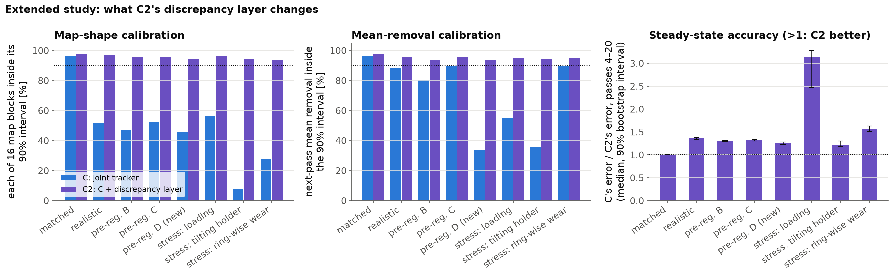

# sanding-wear-tracker

A simulation study of tracking sanding-pad stiffness and abrasive wear together, so that a sanding process model could stay accurate as the paper dulls and say when to change it. The tracker and an extended version of it are tested inside their own model, in a "realistic" simulated world with effects they do not model, in three further worlds fixed before their results were seen, and in stress tests. All results are simulated; nothing has been tested on physical parts.


## 1. Summary

A model that predicts how much material a robotic sanding pass removes needs two things it cannot measure directly: how the compliant pad presses on the part (set by a stiffness that is fixed but unknown) and how sharp the abrasive is (which drops every pass). This project simulates a 125 mm pad sanding a curved panel with hidden stiffness and wear parameters and compares five predictors of the next pass's removal map:
* A, a nominal model with prior-mean parameters;
* B, a model calibrated once on the first scan;
* D, a least-squares fit over all scans of the tracker's own model, with the tracker's priors;
* C, a particle filter that tracks stiffness, force dependence, current effectiveness, a drifting wear rate and a per-pass gain, with a robust scan model;
* C2, the same C plus a discrepancy layer that learns, from C's own errors, the level and the shape of the removal map that C's model cannot produce.

They are tested in several kinds of world:
* the tracker's own (*matched*) world;
* a *realistic* world with effects no predictor models (a foam pad, a Preston pressure exponent, force errors, abrasive break-in and uneven wear across the pad face, scanner artefacts);
* three further mismatch worlds, each committed to the repository before any of its results existed (the last one together with C2), at 100 hidden truths each;
* stress tests (six-ring wear, a tilting pad holder, abrasive loading).

Compared with published values (section 3.6), the Preston exponents, the loading and the forces are inside the reported ranges. The break-in of the earlier worlds is weaker than reported, and pad stiffness and holder tilt are only weakly anchored.

* **Map accuracy.** A and B are far behind (median pass-20 errors of about 2 µm and 11 µm, against about 4 µm of removal). C's first two predictions are better than D's everywhere. From the fourth pass on, C and D are equally accurate (D/C 0.98 matched, 1.00 realistic, 1.00 and 0.99 in two pre-registered worlds), except in the newest pre-registered world, where abrasive loading misleads C and D is more accurate (D/C 0.87). C2 equals C in the matched world and beats it wherever the unmodelled effects change the map's shape or level: from pass 4 on, C's error is 1.36 times C2's in the realistic world and 1.30, 1.32 and 1.25 times in the pre-registered worlds, in every draw. Where the mismatch is only force errors or scanner artefacts, which do not repeat from pass to pass, C2 is 1–2% worse than C (C/C2 0.98 and 0.99, 12 draws). At pass 20 in the realistic world the median errors are 0.287 µm (C2), 0.413 µm (C), 0.429 µm (D) and 0.104 µm for an oracle that knows the true physics.
* **Calibration.** C's 90% intervals for the next pass's mean removal cover 96% of passes 2–20 in the matched world and 89%, 81%, 89% and 34% in the realistic and pre-registered worlds. Checked block by block (16 blocks per map), C covers only 52%, 47%, 52% and 46%. C2 covers 96%, 93%, 95% and 94% of the mean removals and 97%, 96%, 96% and 94% of the blocks.
* **When to change the abrasive.** C's posterior gives the Bayes change rule under its own model for any cost of a late change relative to an early one, with no tuning. Point forecasts need a safety margin. Against D and R (a model-free extrapolation of the scans) with margins tuned on held-out draws for each cost ratio, and after a Holm correction over 30 paired comparisons:
  * C was significantly cheaper in the matched world and against R in two pre-registered worlds;
  * the differences were not significant in most other cases;
  * C was significantly *more* expensive than the tuned D in the newest pre-registered world at cost ratios 1 and 3, where it reads abrasive loading as wear and changes the abrasive about 3 passes early.

  Without tuned margins, point forecasts are far worse when late changes are expensive: at 19:1 in the realistic world C's rule costs 1.53 cost-weighted passes per run, D's 9.89 and R's 16.55. C2 makes the same decisions as C.
* **Weak spots.**
  * Under mismatch the parameters are effective values, not the true ones.
  * Abrasive loading misleads C's abrasive-change decisions (and R's), much more than D's.
  * A tilting pad holder defeats everything: C2's error is still 1.9 µm against the oracle's 0.05 µm, although its intervals are calibrated.
  * Everything is simulated; nothing was tested on physical parts.

## 2. Credit and scope

This project builds on the problem described in GrayMatter Robotics' post
**[World Models for Manufacturing Processes](https://factory.graymatter-robotics.com/world-models-for-manufacturing-processes/)**
(Hantao Ye, Omey Manyar and Satyandra K. Gupta, 2 September 2026). Three points from the post shape this work:

- **The model.** A sanding world model takes the scanned surface and a candidate action (path, force, grit, spindle speed, dwell) and predicts the result.
- **The stiffness range.** On a curved panel, GrayMatter's simulator predicts contact over roughly 5% to 97% of the pad face across physically plausible stiffnesses. The post does not give the panel radius, pad size or force.
- **The calibration problem.** Pad compliance, abrasive behaviour and wear are hard to identify exactly, so the model is conditioned on real observations.

**This is an independent, simplified simulation of that problem. It uses no GrayMatter data, code or models.** Every result below comes from the simulator in this repository (`results/`, produced by `python -m swt run-all`); the 5–97% contact range is quoted from GrayMatter's post. The extension studied here is having two unknowns at once, one fixed (pad stiffness) and one that changes every pass (abrasive wear), and testing the tracker against effects it does not model.

## 3. Model

Units are mm, N, s and MPa (= N/mm²). Pad stiffness `k_pad` is in N/mm³, abrasive effectiveness `K` in mm²/N (= 1/MPa), and wear rate `λ` in 1/mm³. All parameter values are in `configs/default.yaml`; the copy used for the reported run is in `results/run_info.json`.

The simulator has two layers. The **tracker's model** (below) is what estimators A–D assume (C2 starts from it too). The **hidden process** runs either in that same model (the *matched* world) or in a *realistic* world that adds five effects the estimators do not model (section 3.6).

### 3.1 Workpiece and toolpath (`swt/geometry.py`)
* **The part** is a height map on a 1 mm grid (30351 nodes): a convex cylindrical section, 200 mm along the straight x direction and 150 mm across the curved y direction, radius 300 mm (edges 9.5 mm below the crown).
* **One pass** is a serpentine raster: 11 lines along x, 15 mm apart; pad-centre stations every 5 mm (451 per pass); feed 25 mm/s; 0.25 s dwell at both ends of each line; 93.5 s per pass. The pad centre runs to the panel edge, so edge stations overhang the part.
* **Between passes** only the commanded normal force changes (alternating 20 N / 40 N). Spindle speed is part of the action but constant here.

### 3.2 Pad contact (`swt/pad.py`)
At each station the pad face is held tangent to the surface at the pad centre; a point under the pad lies a gap `g` below the pad plane (0 at the centre, 6.58 mm at the rim of the 125 mm pad). Pushing the pad in by `d` gives a Winkler pressure and a force balance:

```
p = k_pad · max(0, d − g)          [MPa]
Σ_i p_i · A_i = F                  (A_i = pad-face area over grid node i)
```

The balance is piecewise linear in `d` and is solved exactly (sorted gaps, one linear piece); a Brent solver gives the same root in the tests. A stiff pad touches a thin strip under its centre; a soft pad wraps around the curvature.

**Stiffness prior.** At 30 N, contact runs from **5.1% of the pad face for the stiffest pad to 97.3% for the softest**, reproducing the 5–97% range quoted in GrayMatter's post (their geometry is not published, so this calibrates the prior to the quoted range rather than reproducing their setup). At 20 N and 40 N the range is 5.1–89.0% and 7.1–100.0%; on a 0.25 mm grid the 30 N range is 5.8–97.0% (the stiff end is quantised by the 1 mm grid). The softest pads indent 4.1–6.8 mm at 20–40 N, beyond where a linear law holds for real foam; the realistic world's foam pad addresses this (section 3.6).


### 3.3 Removal (`swt/process.py`): Preston's law with wear during the pass
```
dh = K · p · v · dt
```
`v` is the RMS sliding speed of a random-orbital sander (5 mm orbit at 8000 rpm plus free pad rotation at 2% of spindle speed), `v(r) = sqrt((π·D_orb·f)² + (2π·f·0.02·r)²)`, from 2094 mm/s at the pad centre to 2342 mm/s at the rim. With nominal parameters a fresh abrasive removes on average 8.1 µm at 20 N and 16.1 µm at 40 N.

**Wear.** `K = K0 · exp(−λ·W)`, with `W` the cumulative removed volume (by analogy with the grinding G-ratio; an assumption, untested here). Wear acts *during* the pass: within a pass `K(U) = K_start / (1 + λ·K_start·U)`, where `U` is the volume the pass would have removed at unit effectiveness so far. It is applied at the resolution of one raster line, using each line's exact average effectiveness, so the volume of the removal map is exactly the volume that drives the wear (a test checks this to 1e-9). Between passes a small multiplicative fluctuation stands in for abrasive variability:

```
K_{n+1} = K_n · exp(−λ·ΔV_n + σ_w·ξ_n),   ξ_n ~ N(0, 1),   σ_w = 0.01
```

### 3.4 Scan (`swt/scan.py`)
The scanner reports each pass's removal on a 2 mm sub-grid (7676 points, read as profiles along y, one every 2 mm in x) with independent Gaussian noise, σ = 2 µm. In the realistic world it also has artefacts (section 3.6).

### 3.5 Hidden truth and priors
| Parameter | Prior | Notes |
|---|---|---|
| `k_pad` | log-uniform on [0.00063, 5] N/mm³ | 97% to 5% contact at 30 N |
| `K0` (fresh effectiveness) | log-normal, median 6.0e-5 mm²/N, σ_log 0.25 | |
| `λ` (wear rate) | log-normal, median 2.5e-4 1/mm³, σ_log 0.35 | |
| wear fluctuation | σ_w = 0.01 per pass | the tracker's starting assumption |

Each draw id fixes `k_pad`, `K0`, `λ` (and the realistic world's force error) through its own random streams, so every world and schedule sees the same hidden parameters for the same draw. Draws 0–99 are used for the reported experiments and draws 200–219 only for tuning (section 3.8).

### 3.6 The realistic world: effects no estimator models
| Group | What the hidden process does | Size |
|---|---|---|
| **Foam pad** | `p = k·δ / (1 − δ/h)`, h = 15 mm: the pad stiffens as it densifies (same small-strain stiffness `k`) | softest pad at 40 N: peak strain 35%, peak pressure ×1.19, contact 96% instead of 100%; negligible for mid and stiff pads (×1.01 at the nominal pad) |
| **Preston exponent** | removal ∝ `p^α` instead of `p` (`dh = K·p_ref·(p/p_ref)^α·v·dt`, p_ref = 10 kPa): the force dependence and the pressure profile both change | α = 0.8; at 30 N a soft pad removes 1.73× the volume per unit `K` of a stiff pad (1.0 for α = 1) |
| **Force errors** | actual force = gain × commanded (one gain per run), and each raster line runs at its own force, AR(1) along the pass (first-order exposure model, checked against the exact model to < 0.1%) | gain: log-normal, σ_log = 0.04; ripple σ = 3% per line, correlation 0.5 between lines |
| **Abrasive** | (i) two-stage wear `K/K0 = (1−f)·e^{−λW} + f·e^{−rλW}`: a fast break-in of the sharpest grit tips plus slow dulling (f = 0.25, r = 6), integrated within the pass; (ii) the inner and outer halves of the pad face wear apart, each with its own local work (mild ring-wise wear) | `K` halves after 1766 mm³ instead of 2773 mm³ (nominal λ); after 20 nominal passes a stiff pad's effective `K` is 30% of fresh instead of 32% |
| **Scanner effects** | per-scan misregistration of the whole map; a constant offset per scan profile; outliers; missing points (isolated and 8-point gaps along profiles); and the removal is measured as the difference of the height scans before and after the pass, each pass leaving a new random surface texture (so each texture enters two consecutive scans with opposite signs) | registration σ = 0.3 mm per axis; profile offset σ = 0.5 µm; 0.5% outliers of σ = 15 µm; 2% missing; texture 1 µm RMS, correlation length 1 mm |

Each group is also run on its own ("only" worlds). Two further worlds:
* **Stress test: ring-wise abrasive wear** (`radial_wear`, not part of the realistic world). The pad face is split into 6 rings, each of which dulls with its own local work. A stiff pad touches only a strip through its centre, so its centre wears out first and the shape of the removal map changes over time, which neither C's nor D's model family can represent. With nominal parameters, a stiff pad's effective `K` after 20 passes is 33% of fresh against 37% with uniform wear (soft pad: 36% vs 37%).
* **Stress test: tilting pad holder** (`edge_tilt`, not part of the realistic world). The holder lets the pad tilt against a rotational spring (20000 N·mm/rad) until the moment of the pad pressure about the pad centre balances it; penetration and two tilt angles minimise the contact energy (damped Newton for all stations at once; force and moment balance are checked in the tests). Where the pad overhangs an edge this pushes pressure towards the edge. At 40 N the largest tilt is 4.2° for the softest pad, 2.1° for the nominal one and 0.7° for the stiffest, and the pass's exposure map changes by 37% RMS (nominal pad). Linear pad, otherwise the tracker's own model; C and D assume a rigid holder.
* **Stress test: abrasive loading** (`loading`, not part of the realistic world). Swarf clogs the abrasive while it cuts: each raster line's effectiveness is multiplied by (1 − L), where the loading L grows along the pass towards 15% with the removed volume (e-folding 50 mm³) and half of it is shed between passes. With nominal parameters it removes 11% of pass 1's volume and 5% of pass 20's. Loading is temporary, so the abrasive-change threshold still refers to the wear alone. It was first part of the realistic world. On the held-out tuning draws it broke C's calibration (predictive coverage about 55–65% in the realistic world instead of about 90%), so, like six-ring wear before it, it was moved to a stress test. That move was made after seeing those held-out results.
* **Three pre-registered worlds** (labelled pre-registered B, C and D in the figures). Their effects and sizes were committed to the repository before any result in them was computed, and they were never used for tuning or development (apart from the tiny end-to-end test configuration, whose outputs were not inspected).
  * `realistic_b` (commit `e05601c`), harsher than the realistic world: foam pad h = 10 mm, Preston exponent 0.7, force gain σ_log 0.06 and ripple 5% (correlation 0.7), two-stage wear with f = 0.4, r = 4 *and* ring-wise wear (6 rings), registration σ 0.5 mm, profile offsets 1 µm, 1% outliers, 5% missing, texture 1.5 µm. Only the world was frozen at that commit: C's force exponent, transient gain and D's current form were added afterwards (section 3.8).
  * `realistic_c` (commit `88ea220`), committed together with the final tracker C, whose code (`PFConfig` and `ParticleFilter`) has not changed since: foam pad h = 20 mm, Preston exponent 0.85, force gain σ_log 0.03 and ripple 4% (correlation 0.3), two-stage wear with f = 0.15, r = 8 and two-ring wear, registration σ 0.2 mm, profile offsets 0.3 µm, 1% outliers, 3% missing, texture 0.8 µm.
  * `realistic_d` (commit `bdac269`), committed together with tracker C2 (section 3.7), whose code and settings have not changed since; its sizes follow the published values in the table below where any exist: a tilting holder (100000 N·mm/rad, linear pad; at 40 N the largest tilt is 0.6° for the nominal pad), Preston exponent 0.65, force gain σ_log 0.04 and ripple 3%, two-stage wear with a break-in share f = 0.45 (r = 8) and two-ring wear, abrasive loading of up to 20% of which only 30% is shed between passes, and the realistic world's scanner artefacts.

**How the effect sizes compare with published values.** I chose the sizes of the mismatch effects; this table compares them with what a literature search found (values marked † were computed from a source's table or equation, not stated by its authors). Most published data are for wood or metal belt sanding, few for paint or clear coat with a compliant pad, so these are anchors, not measurements of the simulated process.

| Effect | This study | Published | Verdict |
|---|---|---|---|
| Preston exponent α (removal ∝ p^α) | 0.8 (realistic), 0.7, 0.85, 0.65 (pre-registered B, C, D) | ≈1 for coarse SiC paper, sub-linear for fine grits [2]; †0.61–0.72 for robotic sanding of aircraft primer [3]; †0.55 for belt grinding on a polyurethane wheel [8] | inside the published 0.55–1.0 |
| Abrasive break-in (share of the initial cutting lost in the fast phase) | f = 0.25 (realistic), 0.4, 0.15, 0.45 (pre-registered B, C, D) | †0.32–0.40 (beech) and more for oak [1]; break-in ends at 45–50% of the initial efficiency [5]; clear-coat discs lose 23–62% of their cut from the first to the second minute [7] | below the reported range in the realistic world and `realistic_c`; inside for B and D |
| Abrasive loading | stress test 15%, pre-registered D 20% (only partly shed) | 15–70% loss of wear rate from clogging [2]; anti-loading coats recover 15–24% of the cut [7]; loading builds fast, saturates, and cleaning never restores a new belt [6] | inside; the build-up volume and the shed fraction are not published |
| Pad stiffness (Winkler k = E / thickness) | prior log-uniform on [0.00063, 5] N/mm³ | one direct value: E = 672 kPa over 9 mm, k ≈ 0.075 N/mm³ [4] | inside, but the stiffest decade (k > 2 N/mm³) is stiffer than any compliant tool found |
| Holder tilt stiffness | 2×10⁴ (stress test), 1×10⁵ N·mm/rad (pre-registered D) | no sanding-specific value; an assembly compliance device has 5.5×10⁵ N·mm/rad [9]; a floating polishing head tilts up to about ±7° [10] | weakly anchored |
| Normal force | 20 and 40 N, 125 mm pad | 15–58 N in robotic and laboratory sanding with 125–150 mm pads [3, 4, 7] | inside |

[1] Očkajová et al. (2016), *BioResources* 11(2):5242, doi:10.15376/biores.11.2.5242-5254. [2] De Pellegrin, Torrance & Haran (2009), *Wear* 266:13, doi:10.1016/j.wear.2008.05.015. [3] Shi et al. (2025), *Technologies* 13:498, doi:10.3390/technologies13110498. [4] Devine (2022), PhD thesis, University of Washington, "Material Removal Control for Teleoperated Robotic Sanding". [5] Sydor et al. (2021), *Applied Sciences* 11:2860, doi:10.3390/app11062860. [6] Saloni, Lemaster & Jackson (2010), *Sensors* 10:10401, doi:10.3390/s101110401. [7] 3M Innovative Properties, US patent 10,688,625 B2, "Abrasive article". [8] Pandiyan et al. (2020), *Symmetry* 12:99, doi:10.3390/sym12010099. [9] ATI Industrial Automation, Remote Center Compensator 9116-211-A, product data. [10] Liu et al., *Transactions of the CSME*, doi:10.1139/tcsme-2024-0064 (accepted manuscript).

The **oracle** reference always uses the hidden process's own physics.

### 3.7 Estimators (`swt/estimators.py`)
All five see the commanded action of every pass and the scans, and nothing else; before each pass each predicts that pass's removal at the scan points.

**A: nominal.** Prior-mean parameters (geometric-mean stiffness 0.0561 N/mm³, prior medians of `K0` and `λ`), wear propagated with its own predicted volume, never updated.

**B: calibrate-once.** Least-squares `k_pad` and `K` from the first scan (`K` profiled out, 1-D search over log `k_pad`), then frozen, no wear model. The "learn the pad once" baseline.

**D: joint least squares with C's priors** (the strongest point baseline: C's model structure and priors, fitted by penalised least squares instead of Bayesian inference). After every scan: points more than 5 robust s.d. from a fit of that scan alone are rejected; one stiffness is fitted to *all* scans so far (sum of the per-scan least-squares errors, each with its own `K` profiled out, including within-pass wear at the current wear rate); a fit of log `K_i` against cumulative removed volume and log force, penalised by C's priors on `λ` (log-normal, linearised at its median) and `β` (N(1, 0.15²)), with the log `K_i` noise set to C's prior median wear-fluctuation and transient levels, gives the wear rate and the force exponent (the MAP estimate, so one or two scans cannot give a wild wear rate); the two steps are iterated twice. The next pass uses the pooled stiffness and the latest `K`, extrapolated through the pass just scanned and rescaled to the next force. Its abrasive-change forecast extrapolates the same fit, with `K0` = the first scan's `K`; for decisions it reports its forecast of `K/K0` at the start of the next pass. Point predictions only: D has no uncertainty, no wear-rate drift, no transient gain and no scanner-offset model.

**C: joint tracker.** A sequential Monte Carlo filter with 2000 particles over log `k_pad`, a force exponent `β`, the wear-fluctuation level `σ_w`, a transient-gain level `σ_g` (all static) and the paths of log `K`, log `λ` and a per-pass gain `g` (one value per pass):
* *Process model:* removal of a pass with scale `K·e^g·F·s·(F/F_ref)^(β−1)` (`β` = 1 is Preston's law; prior N(1, 0.15²) on [0.5, 1.5], F_ref = 30 N) and within-pass wear as in 3.3. The gain `g ~ N(0, σ_g²)` belongs to one pass only (force ripple, local loading) and does not carry over, unlike `K`; `σ_g` has a log-uniform prior on [0.002, 0.05]; between passes `log K` follows the wear law plus noise of s.d. `σ_w`, and `log λ` takes a random-walk step of s.d. `δ` (the *wear-rate drift*), so the wear rate can follow the recent decay when the true law is not exponential. `σ_w` has a log-uniform prior on [0.005, 0.05] and is learned from how much `K` varies beyond the wear law; `δ` is tuned on held-out draws (3.8).
* *Update:* the scan likelihood is applied in tempered stages that keep the effective sample size at 75% of N. After each stage the particles are resampled systematically and moved by Metropolis–Hastings steps that leave the exact path posterior invariant: a joint random walk on log `k_pad`, `β` and a common shift of the whole log `λ` path; random walks on log `σ_w` and log `σ_g`; local moves on log `λ` and log `K` near the current pass; and "ridge" moves that shift log `K` up and `g` down by the same amount at a pass (the scan likelihood is unchanged; only the split between persistent and transient changes). After the last stage a full-path sweep also moves log `K`, log `λ` and `g` at every earlier pass. Every past scan is kept as O(1) sufficient statistics, so every move evaluates the full path posterior. The number of distinct particle values left at the most degenerate stored pass is recorded per pass (`C_min_path_diversity`).
* *Robust measurement model:* (i) points more than 5 robust s.d. from C's own prediction for the pass are rejected (on pass 1, from the fitted map, with one redo); (ii) a random offset per scan profile is added to the noise model when the profile means vary significantly more than the noise explains (variance estimated from the residuals, folded exactly into the sufficient statistics via the Woodbury identity); (iii) the noise level is re-estimated from the residuals and inflated when they are spatially correlated. In the matched world they almost never act (median 0 rejected points per scan, 4 of the 100 × 20 updates redone); in the realistic world the median is 15 rejected points per scan and 532 updates were redone.
* *Speed:* removal depends on stiffness only through `η = F/k_pad`; maps at the scan points are tabulated once on 512 log-spaced η values, with the within-pass wear expanded to third order. Against the exact model the relative RMS error is at most 1.7e-03 (median 3.4e-05, 90 checks). The hidden process and A, B use the exact model; D uses the same table as C.
* *Outputs:* posterior median and 90% interval of `k_pad`, `K0`, current `K`, current `λ` and `β`; 90% predictive intervals of the next pass's mean removal over the whole scan and over each of 16 blocks (4 × 4) of it; and the distribution of the abrasive-change pass (particles rolled forward with their own `σ_w` and `σ_g`, random future wear and wear-rate drift), from which C reports a median, a ≥90% band and the probability that the change is due by the next pass.

**C2: C plus a discrepancy layer** (`swt/tracker2.py`, frozen with `realistic_d` in commit `bdac269`). C2 runs C unchanged and learns, from C's own one-pass-ahead errors, what C's model family cannot represent:
* a *level* factor for the next pass's removal: an exponentially weighted (memory 0.8 per pass), precision-weighted mean of the log ratio of observed to predicted mean removal, shrunk towards zero by a positive-part James–Stein factor;
* a *shape* field: one log factor per block of a 4 × 4 grid over the scan, with a removal-weighted mean of zero (so it moves removal around the part but not its level), each block's discounted mean log ratio (memory 0.8) shrunk towards zero by an empirical-Bayes factor whose signal variance is estimated across the blocks, and interpolated bilinearly between block centres.

Both shrink to zero when C's errors look like noise, so in C's own world C2 should do what C does. C2's predictive intervals are log-normal: the spread of C's particle predictions, shifted by the discrepancy and widened by its uncertainty and by an unexplained variance learned from the errors. C2 changes predictions only: a level error of the removal cannot be pinned on the abrasive from the scans alone (a tilting holder or a foam pad also cause one), so C2's abrasive-change decisions are C's. On held-out draws, moving C's estimate of `K` by the level error helped under abrasive loading but hurt under a tilting holder and in the tracker's own world, about equally. C2's design and its four settings were fixed on held-out draws 200–215 only.

**Oracle (reference).** Knows the hidden process's physics and its true state after the previous pass, but not the wear fluctuation drawn since then, nor the coming pass's force ripple or surface texture. Its error is a floor in expectation; on single passes C can beat it by luck.

### 3.8 Tuning, development and what changed after the first full run
Two kinds of setting are tuned by the pipeline, both on held-out draws: C's wear-rate drift `δ`, and the safety margins of D's and R's abrasive-change rules (section 4.4; C's rules need none). `run-all` runs C with each `δ` of 0, 0.05, 0.1 and 0.15 on held-out draws 200–215 in the matched and realistic worlds, and keeps the value with the lowest mean *interval score* of the 90% predictive interval of next-pass mean removal (a proper scoring rule: interval width plus 20× any miss; Gneiting & Raftery 2007). It chose **δ = 0.1**.

**What changed after the first full run.** This README reports the fifth full run on draws 0–99. After each of the first four, an independent review pointed out weaknesses, and these changes were made. *Rounds 1–2:* D gained within-pass wear, outlier rejection, a force term, a pooled stiffness and a first-scan `K0`; C's heuristic adaptive process noise was replaced by the learned `σ_w`, and a full-path sweep, the force exponent `β` and the transient gain `g` were added; the "mean over passes" comparison excludes pass 1 (a prior prediction for every estimator) and uses a geometric mean; the realistic world gained the Preston exponent and the scan texture, and ring-wise wear (6 rings) was moved to a stress test. *Round 3:* the abrasive-change evaluation became a set of sequential decision rules scored by cost against a model-free rule, and a block-level calibration check was added. The `realistic_c` world and the final C were committed together (commit `88ea220`) before C was run in it; C has not changed since. *Round 4:* the third review found that C's accuracy edge over D under mismatch came almost entirely from passes 2–3, and that C's decision rule had been compared with an untuned D. So D now uses C's priors on `λ` and `β` (a MAP fit), the comparison is split into start-up (passes 2–3) and steady state (passes 4–20), and the decision rules of D and R get safety margins tuned on held-out draws for each cost ratio. The physics gained mild ring-wise wear (two rings) in the realistic world, and abrasive loading and a tilting pad holder as stress tests. The realistic world therefore changed after C was frozen (it became harder); the pre-registered worlds did not. *Round 5:* the effect sizes were compared with published values (section 3.6); tracker C2 was designed on held-out draws and committed together with a new world, `realistic_d`, in commit `bdac269`, before either was run in it; the decision comparisons gained paired permutation tests with a Holm correction; and the pre-registered worlds moved to an extended run (`run-all --extended`) at 100 draws each (40 before), with the stress tests repeated there at 30 draws, so that the core `run-all` stays under 10 minutes. C has not changed since `88ea220`. *Run time:* to keep `run-all` under 10 minutes, the scan statistics are computed with fewer passes over the tables (equal to rounding error, checked against the direct formula by a test), tuning shares each hidden truth across the candidate drifts, the single-effect and stress worlds use 12 draws (and skip baseline B, which is not reported for them), the noise study 12 draws at 1, 2, 5 and 10 µm, the ablation 20 draws, D's stiffness search starts from a coarser grid before its bounded optimiser, and the tuning 16 held-out draws per world over δ = 0, 0.05, 0.1 and 0.15 (δ = 0.2 had scored worse than 0.1 and 0.15 in the third run). All checks behind these changes used held-out draws 200–239 only. Other settings (75% ESS target, one final full-path sweep, outlier threshold 5, the `σ_w`, `σ_g` and `β` priors) were fixed by hand during development.

## 4. Results

All numbers come from `results/` and were produced by `python -m swt run-all` with seed 2026. Unless a section says otherwise, every run has 20 passes, forces alternating 20/40 N, 2 µm scan noise and the 50%-of-K0 abrasive-change threshold. Errors are RMSE over the 7676 scan points against the simulator's noise-free removal (not against the scan). Brackets after medians are IQRs unless marked as 90% bootstrap intervals (2000 resamples of the draws).

**At a glance: removal-map RMSE at pass 20, µm, median [IQR]** (matched and realistic: the core run; the pre-registered worlds: the extended run, `run-all --extended`)

| world | A: nominal | B: calibrate-once | D: joint least squares | C: joint tracker | C2: C + discrepancy layer | oracle |
|---|---|---|---|---|---|---|
| matched (100 draws) | 2.20 [1.52–4.24] | 10.62 [8.92–13.16] | 0.057 [0.030–0.088] | 0.054 [0.027–0.086] | 0.056 [0.030–0.086] | 0.042 |
| realistic (100 draws) | 2.27 [1.63–3.48] | 10.50 [8.66–12.44] | 0.429 [0.340–0.536] | 0.413 [0.324–0.524] | 0.287 [0.222–0.344] | 0.104 |
| `realistic_b` (100 draws) | 2.69 [1.94–3.59] | 10.38 [8.69–12.82] | 0.516 [0.417–0.631] | 0.489 [0.375–0.600] | 0.350 [0.276–0.431] | 0.135 |
| `realistic_c` (100 draws) | 2.10 [1.54–3.55] | 10.52 [8.80–12.67] | 0.477 [0.361–0.577] | 0.459 [0.350–0.557] | 0.310 [0.246–0.394] | 0.147 |
| `realistic_d` (new) (100 draws) | 3.23 [2.55–4.02] | 8.20 [6.78–10.32] | 0.433 [0.306–0.621] | 0.486 [0.333–0.658] | 0.374 [0.222–0.591] | 0.063 |

**C against D** (paired over draws; D/C is the ratio of D's to C's error, so above 1 means C is more accurate; medians over draws with 90% bootstrap intervals; geometric means over the passes of each window)

| world | start-up, passes 2–3: D/C | C better | steady state, passes 4–20: D/C | C better | pass 20 (a 40 N pass): D/C | C better |
|---|---|---|---|---|---|---|
| matched | 1.39 [1.16–2.07] | 60 / 100 | 0.98 [0.95–1.01] | 44 / 100 | 1.02 [0.88–1.10] | 51 / 100 |
| realistic | 1.77 [1.48–1.93] | 87 / 100 | 1.00 [0.99–1.01] | 47 / 100 | 1.01 [1.01–1.02] | 64 / 100 |
| `realistic_b` | 1.38 [1.32–1.61] | 80 / 100 | 1.00 [0.99–1.01] | 48 / 100 | 1.03 [1.01–1.06] | 65 / 100 |
| `realistic_c` | 1.42 [1.25–1.54] | 79 / 100 | 0.99 [0.99–0.99] | 39 / 100 | 1.01 [1.00–1.01] | 60 / 100 |
| `realistic_d` (new) | 1.73 [1.62–1.83] | 97 / 100 | 0.87 [0.85–0.88] | 0 / 100 | 0.95 [0.94–0.96] | 20 / 100 |

**Start-up and steady state.** C's advantage over D is confined to the first two predictions. On passes 2–3, when D has one or two scans, C's error is smaller in every world (median D/C 1.39, 1.77, 1.38, 1.42 and 1.73). This is probably because C averages its prediction over what one or two scans leave uncertain (stiffness, force exponent, wear rate) where D plugs in point estimates, and because of C's scanner model. From pass 4 on, C and D are equally accurate to within about 2% in four of the five worlds: the median D/C ratios are 0.979, 0.997, 0.996 and 0.990, and none of their 90% intervals lies more than 2% from 1 (in `realistic_c`, D is about 1% better, with an interval that excludes 1). In `realistic_d`, D is clearly more accurate (0.871; C better in 0 of 100 draws): C reads the abrasive loading as wear and under-predicts the next pass once part of the loading is shed. Pass 20 is a 40 N pass; averaged over passes 19 and 20 (one at each force), the realistic-world ratio is 1.010 [0.998–1.016], within noise of 1.

**Calibration of C and C2** (target 90%)

| world | C: next-pass mean removal inside its 90% interval, passes 2–20 | truth below / above | C: passes 2–5 / 11–20 | C: each of 16 map blocks inside its interval | C2: mean removal | C2: blocks | C: true parameter inside the 90% interval at pass 20, k_pad / λ / K / K0 |
|---|---|---|---|---|---|---|---|
| matched | 1833 / 1900 (96.5%) | 29 / 38 | 99.5% / 94.2% | 96% | 97.4% | 98% | 91 / 100 / 97 / 98 of 100 |
| realistic | 1682 / 1900 (88.5%) | 32 / 186 | 85.0% / 90.7% | 52% | 95.8% | 97% | 3 / 86 / 8 / 6 of 100 |
| `realistic_b` | 1530 / 1900 (80.5%) | 65 / 305 | 72.0% / 84.9% | 47% | 93.3% | 96% | 4 / 61 / 10 / 7 of 100 |
| `realistic_c` | 1700 / 1900 (89.5%) | 42 / 158 | 85.5% / 90.8% | 52% | 95.4% | 96% | 3 / 82 / 11 / 6 of 100 |
| `realistic_d` (new) | 646 / 1900 (34.0%) | 4 / 1250 | 24.8% / 41.2% | 46% | 93.6% | 94% | 0 / 0 / 3 / 6 of 100 |

The block column splits each scan into 4 × 4 blocks and checks each block's mean removal against C's 90% interval for that block, so it tests the predicted map shape as well as its level. With 100 draws the binomial standard error of a calibrated 90% parameter coverage is 3 points (3 with the 100 draws of the pre-registered worlds). In the mismatch worlds the parameter intervals describe *effective* parameters (section 4.1) and are not expected to cover the true values.

### 4.1 Main run: one hidden truth in both worlds

The draw is chosen by a rule that looks only at the sampled truths: among the 100 robustness draws, the one at the median standardised distance from the prior centre in (log k_pad, log K0, log λ). It is draw 15: `k_pad` = 0.2034 N/mm³, `K0` = 4.93e-05 mm²/N, `λ` = 0.000392 1/mm³, and in the realistic world a force gain of 0.979. Its abrasive crosses 50% at pass 11 in the matched world and at pass 7 in the realistic world (the break-in and the faster-wearing pad centre bring it forward); A's nominal model says pass 13.

| Removal-map RMSE [µm] | A | B | D | C | oracle |
|---|---|---|---|---|---|
| realistic, pass 2 | 6.45 | 2.20 | 1.62 | 0.89 | 0.26 |
| realistic, pass 20 | 2.81 | 7.36 | 0.334 | 0.358 | 0.078 |
| matched, pass 20 | 1.91 | 8.89 | 0.049 | 0.111 | 0.065 |


* **B** is good right after its calibration but never learns that the paper is dulling, so its error grows with every pass.
* **A** has the wear law but the wrong parameters.
* **D and C** both follow the wear. On this draw D's pass-20 error is lower than C's in both worlds; single passes are noisy, and section 4.2 has the statistics over 100 draws.
* **Parameters at pass 20 (figure 4):**

  | | C: median [90% interval], matched world | C: median [90% interval], realistic world | truth |
  |---|---|---|---|
  | `k_pad` [N/mm³] | 0.2034 [0.2027, 0.2042] | 0.1809 [0.1795, 0.1823] | 0.2034 |
  | `λ` [1/mm³] | 0.000356 [0.000273, 0.000458] | 0.000377 [0.000268, 0.000533] | 0.000392 |
  | `K0` [mm²/N] | 4.94e-05 [4.88e-05, 5.01e-05] | 3.92e-05 [3.84e-05, 4.02e-05] | 4.93e-05 |

  In the realistic world the same tracker converges on an *effective* stiffness and an effective wear rate that is high during the break-in and falls later: the best linear-pad, exponential-wear description of a process that is neither, with the force gain absorbed into the effectiveness. Its map predictions remain good because they only need the effective values to reproduce the removal, not to equal the true parameters.


### 4.2 Robustness: what the numbers say

* **Map accuracy.** A and B are one to two orders of magnitude worse than C and D throughout (figure 3). C and D differ only on the first two predictions (table above), except in `realistic_d`, where D is more accurate from pass 4 on. Under mismatch both stay well above the oracle: at pass 20 in the realistic world C's median error is 4.1 times the oracle's, mostly because of the two-ring wear and the Preston exponent (section 4.3), which change the map's shape. C2 narrows that gap but does not close it (0.287 µm against C's 0.413 µm and the oracle's 0.104 µm; section 4.9).
* **What C adds over D.** Not steady-state map accuracy. It adds better first predictions, uncertainty that is calibrated for the level of the next pass (except under abrasive loading), and with it abrasive-change decisions that need no tuning (section 4.4).
* **What C2 adds over C.** Steady-state map accuracy under mismatch, and intervals that are calibrated for the map's shape as well as its level (section 4.9). It does not change the decisions.
* **Calibration of the mean removal.** In the matched world C's predictive intervals are conservative (99.5% in passes 2–5, while `σ_w` and `σ_g` are still uncertain; 94% from pass 11) and its parameter intervals cover the truth at or above the nominal rate. In the realistic world they cover 89%, and most misses have the truth above the interval (186 above, 32 below): the abrasive keeps cutting better than an exponential law fitted through the break-in predicts. In the pre-registered worlds coverage is close to nominal in the milder `realistic_c` (89%), 81% in the harsher `realistic_b` (72% in passes 2–5), and only 34% in `realistic_d`, where the truth lies above the interval in 1250 of the 1900 passes: C reads the loading as wear and expects too little removal. C2's intervals cover 96% in the realistic world and 93%, 95% and 94% in the pre-registered worlds.
* **Calibration of the map shape.** Block by block the intervals cover 96% in the matched world but only 52%, 47%, 52% and 46% in the mismatch worlds. Under mismatch C gets the level of the next pass about right (except under loading) but not its distribution over the part: uneven wear across the pad face, the foam pad and the Preston exponent change the map's shape in ways a linear-pad, uniform-wear model cannot follow, and C's uncertainty does not include that. C2's shape layer learns most of it from C's errors: its block intervals cover 97%, 96%, 96% and 94%.

### 4.3 What each unmodelled effect costs

Each group of the realistic world was also run alone, on the first 12 draws (same draws in every world; figure 7, left), plus the three stress tests (the extended run repeats these with 30 draws each; section 4.9). C's columns are C alone; C2's decisions are C's, so the crossing error is the same for both.

| world (12 draws, pass 20) | C RMSE [µm] | D RMSE [µm] | C2 RMSE [µm] | oracle [µm] | C / oracle | C predictive coverage (misses below↓ above↑) | C2 coverage | C crossing error, last pass before (mean, passes) |
|---|---|---|---|---|---|---|---|---|
| matched | 0.073 | 0.069 | 0.073 | 0.061 | 1.58 | 96% (3↓ 6↑) | 97% | 0.25 |
| foam pad only | 0.078 | 0.085 | 0.078 | 0.061 | 1.73 | 95% (5↓ 7↑) | 96% | 0.25 |
| Preston exponent only | 0.257 | 0.258 | 0.225 | 0.059 | 4.49 | 96% (4↓ 5↑) | 98% | 0.30 |
| force errors only | 0.174 | 0.166 | 0.174 | 0.157 | 0.95 | 86% (16↓ 16↑) | 93% | 0.58 |
| two-stage and two-ring wear only | 0.390 | 0.394 | 0.240 | 0.052 | 7.62 | 96% (7↓ 3↑) | 98% | 0.50 |
| scanner effects only | 0.055 | 0.155 | 0.065 | 0.061 | 1.06 | 95% (1↓ 10↑) | 96% | 0.00 |
| realistic (all of the above) | 0.390 | 0.413 | 0.277 | 0.109 | 3.59 | 87% (4↓ 25↑) | 98% | 0.42 |
| stress test: ring-wise wear | 0.600 | 0.601 | 0.337 | 0.058 | 10.00 | 90% (21↓ 2↑) | 96% | 0.42 |
| stress test: tilting pad holder | 2.570 | 2.548 | 2.087 | 0.064 | 38.22 | 33% (0↓ 152↑) | 93% | 0.25 |
| stress test: abrasive loading | 0.326 | 0.199 | 0.156 | 0.057 | 6.74 | 53% (0↓ 108↑) | 95% | 1.90 |

* **Preston exponent:** C and D both learn the force dependence (`β`), so the alternating 20/40 N schedule no longer produces alternating biases, but the flatter `p^0.8` pressure profile cannot be reproduced by any linear-pad stiffness: a large cost in map accuracy, second only to uneven wear.
* **Force errors** raise everyone's error, the oracle's included (the line-to-line ripple is unpredictable). D is slightly more accurate than C here, and C's intervals under-cover with misses on both sides. C2 is no more accurate (its pass-20 error is the same, 0.174 µm) but its intervals cover 93%.
* **Two-stage and two-ring wear** is the largest single cost: C and D are equally accurate and about 8 times worse than the oracle. When the centre of the pad face dulls faster than its rim, the shape of the removal map changes, which neither model represents; C's drifting wear rate follows the slowing decay of the two-stage law. This is where C2's shape layer helps most: 0.240 µm against C's 0.390 µm.
* **Scanner effects** hurt D (no offset model, simple outlier rejection) more than C, whose per-profile offset model and innovation gating absorb most of them (the tests check both). C does not correct misregistration, and treats the scan texture, which is correlated between consecutive scans, as noise. C2 is slightly worse than C here (0.065 µm at pass 20): it reads some of the texture as map shape.
* **The foam pad** changes the map noticeably only for soft pads; stiffness becomes an effective value.
* **Ring-wise wear with six rings (stress test)** makes uneven wear worse: C and D fail alike, at about 10 times the oracle's error, and C's predictions are mostly too high. C2 nearly halves C's error here (0.337 µm), but a tracker for such pads would still need a ring-resolved effectiveness.
* **Tilting holder (stress test)** defeats both trackers: their error is about 38 times the oracle's and C's intervals cover 33%, and in every miss the interval lies below the truth. Pressure moves towards the overhanging edges, which a rigid-holder model cannot represent; edge stations need the tilt in the model. C2 makes the intervals honest (93% coverage) but its error is still 2.09 µm.
* **Abrasive loading (stress test)** hurts C more than D: C's error is 0.326 µm against D's 0.199 µm, its intervals cover 53%, with the interval below the truth in every miss, and its crossing forecasts are off by 1.9 passes on average. C apparently reads the loss of cutting as wear and predicts too little removal once the loading is shed. C2's level factor learns the under-prediction (0.156 µm, coverage 95%), but its decisions are C's, so the crossing forecasts are no better; a loading state would have to be tracked separately to fix them.


### 4.4 When to change the abrasive (threshold: K < 50% of K0)

**The decision.** After each scanned pass, a rule decides whether the next pass runs on fresh abrasive. The ideal is to change at the true crossing pass c (the first pass that would start below 50% of fresh). Error = change pass − c: positive means passes run on worn abrasive (*late*), negative means abrasive life thrown away (*early*). With a cost ratio r, a late pass costs r and an early pass 1. Three ratios are reported: r = 1 (both errors equally bad), r = 3 and r = 19 (a pass on worn abrasive nearly as bad as a scrapped part); the real ratio depends on the shop and was not measured. Only draws whose crossing falls inside the run (c ≤ 21) are scored; a rule that has not fired by pass 20 counts as changing at pass 21.

**The rules.**
* **C_r**: change when C's probability that the crossing happens by the next pass is at least 1/(1 + r) (50%, 25% and 5%). This is the Bayes decision for cost ratio r under C's own model (optimal only if C's crossing distribution is right); it uses C's crossing distribution as it is, with no tuning.
* **D_r** and **R_r**: change when the point forecast of `K/K0` at the start of the next pass is below the threshold raised by a safety margin, 0.5·(1 + m_r). D's forecast comes from its MAP fit; R needs no process model: a least-squares fit of log(scanned mean removal per newton) against cumulative scanned removal (with a log-force term once two forces were seen), extrapolated to the next pass. For each r the margins were tuned on the held-out draws 200–215 (matched and realistic worlds, the draws used for `δ`), over −30% to +50% in steps of 1%: D +0.02 / +0.02 / +0.06 and R +0.02 / +0.05 / +0.05 for r = 1 / 3 / 19. This gives each point forecast its best margin for that cost, chosen on data with known crossings.
* **D** and **R** without a margin, and **A**, the nominal model's crossing pass fixed before the run, are shown for reference.

**Mean cost per draw** (lower is better), and the paired difference to C's rule: mean over draws, 90% bootstrap interval, and the Holm-adjusted p-value of a paired sign-flip permutation test over all 30 comparisons of C_r with D_r and R_r in this table (negative: C is cheaper). Matched and realistic: core run; the pre-registered worlds: extended run.

| r | rule | matched | realistic | `realistic_b` | `realistic_c` | `realistic_d` |
|---|---|---|---|---|---|---|
| 1 | C_1 | 0.15 | 0.54 | 0.83 | 0.65 | 2.95 |
| 1 | D_1 | 0.43 | 0.44 | 0.85 | 0.54 | 0.57 |
| 1 | R_1 | 0.38 | 0.67 | 1.51 | 0.62 | 4.01 |
| 1 | C_1 − D_1 | -0.27 [-0.37, -0.18], p 0.001 | +0.10 [+0.00, +0.21], p 1.000 | -0.02 [-0.16, +0.12], p 1.000 | +0.11 [-0.01, +0.23], p 1.000 | +2.38 [+2.15, +2.61], p 0.001 |
| 1 | C_1 − R_1 | -0.23 [-0.34, -0.13], p 0.014 | -0.13 [-0.28, +0.02], p 1.000 | -0.68 [-0.96, -0.39], p 0.009 | +0.03 [-0.08, +0.14], p 1.000 | -1.06 [-1.38, -0.76], p 0.001 |
| 3 | C_3 | 0.26 | 0.96 | 1.34 | 1.11 | 3.34 |
| 3 | D_3 | 0.43 | 1.10 | 1.89 | 1.22 | 1.31 |
| 3 | R_3 | 1.07 | 0.97 | 2.10 | 0.89 | 4.09 |
| 3 | C_3 − D_3 | -0.16 [-0.29, -0.03], p 0.754 | -0.14 [-0.39, +0.09], p 1.000 | -0.55 [-0.87, -0.23], p 0.093 | -0.11 [-0.32, +0.11], p 1.000 | +2.03 [+1.66, +2.38], p 0.001 |
| 3 | C_3 − R_3 | -0.80 [-0.95, -0.66], p 0.001 | -0.01 [-0.27, +0.25], p 1.000 | -0.76 [-1.19, -0.34], p 0.063 | +0.22 [+0.01, +0.46], p 1.000 | -0.75 [-0.95, -0.58], p 0.001 |
| 19 | C_19 | 0.68 | 1.53 | 1.89 | 2.04 | 3.65 |
| 19 | D_19 | 1.23 | 1.67 | 3.60 | 1.57 | 2.85 |
| 19 | R_19 | 1.07 | 2.25 | 3.06 | 3.15 | 4.09 |
| 19 | C_19 − D_19 | -0.55 [-0.85, -0.10], p 0.013 | -0.14 [-0.98, +0.66], p 1.000 | -1.71 [-3.10, -0.46], p 0.603 | +0.47 [-0.37, +1.41], p 1.000 | +0.80 [-0.42, +1.87], p 1.000 |
| 19 | C_19 − R_19 | -0.38 [-0.67, +0.07], p 0.603 | -0.72 [-1.65, +0.27], p 1.000 | -1.17 [-2.36, -0.07], p 1.000 | -1.11 [-2.17, -0.09], p 1.000 | -0.44 [-0.57, -0.32], p 0.001 |
| 3 | D, no margin | 0.36 | 1.57 | 2.31 | 1.70 | 2.06 |
| 3 | R, no margin | 0.57 | 2.79 | 2.57 | 2.85 | 4.03 |
| 3 | A, nominal schedule | 6.16 | 12.09 | 14.50 | 9.82 | 17.85 |
| | draws scored | 91 | 100 | 100 | 99 | 100 |

**Mean absolute error [passes] (draws within ±1 pass)** of the rules without a cost weighting (r = 1)

| rule | matched | realistic | `realistic_b` | `realistic_c` | `realistic_d` |
|---|---|---|---|---|---|
| C_1 | 0.15 (90) | 0.54 (96) | 0.83 (86) | 0.65 (94) | 2.95 (12) |
| D_1 | 0.43 (88) | 0.44 (97) | 0.85 (86) | 0.54 (96) | 0.57 (96) |
| R_1 | 0.38 (87) | 0.67 (87) | 1.51 (62) | 0.62 (93) | 4.01 (11) |
| D, no margin | 0.19 (90) | 0.53 (94) | 0.89 (85) | 0.61 (93) | 0.74 (92) |
| R, no margin | 0.26 (90) | 1.07 (67) | 1.51 (58) | 0.95 (75) | 3.97 (11) |
| A | 2.93 (24) | 4.25 (14) | 4.92 (10) | 3.68 (20) | 5.97 (3) |

**What the tables say.** C's rules need no tuning: the same posterior gives the rule for every cost ratio. D and R need their margin re-tuned for each ratio, on draws whose crossing is known. Without a margin, their cost grows quickly with the ratio: at r = 19 in the realistic world D costs 9.89 and R 16.55, against C's 1.53. Against the tuned rules, after the Holm correction:

* C is significantly cheaper in its own (matched) world (against D at r = 1 and 19, against R at r = 1 and 3), and against R in `realistic_b` (r = 1) and in `realistic_d` (all three ratios).
* Most other differences are not significant, including every one in the realistic world and in `realistic_c`. In `realistic_b` the advantage over D and R at r = 3, which looked significant with 40 draws in the previous run, does not survive the correction at 100 draws.
* In `realistic_d`, C is significantly *more* expensive than the tuned D at r = 1 and r = 3. The abrasive loading makes C read lost cutting as wear: its median rule changes early in 97 of 100 draws, by 3.0 passes on average, while D's MAP fit is within one pass in 96. The model-free R is misled even more.

So C's posterior is as good as the best tuned point forecast in most worlds and better in its own world, but worse when the abrasive loads. Its practical advantage is that it needs no labelled crossings to set a margin. C2 does not change these decisions (section 3.7).

**Forecast error by lead time** (figure 5, right; a fixed population of draws whose crossing every lead can see). As a *point* forecast of the crossing pass, C's median is no better than D's. In the matched world the two are within about a tenth of a pass of each other up to 8 passes ahead (5 passes ahead: C 0.35, D 0.31, A 2.28 passes), and C is better 9 and 10 passes ahead. In the realistic world D's forecast is the more accurate from 2 to 8 passes ahead (5 passes ahead: C 1.30, D 0.48, A 1.79), and C's early forecasts are biased early (mean signed error after pass 2: -1.02 passes): the break-in makes the abrasive look as if it wears faster than it will. What C adds is the spread: in the realistic world its ≥90% band contains the true crossing in 100% of draws one pass ahead and 94% five passes ahead, falling to 61% ten passes ahead. The C_r rules use that spread.


### 4.5 Tuning: what the drifting wear rate buys

| wear-rate drift δ (held-out draws 200–215) | 0 (constant rate) | chosen: 0.1 |
|---|---|---|
| predictive coverage, matched | 95.4% | 93.8% |
| predictive coverage, realistic | 85.9% | 92.4% |
| median relative width of the 90% interval, realistic | 12.50% | 11.37% |
| mean interval score (lower is better; both worlds) | 0.1325 | 0.1157 |

Larger drifts raise the realistic world's coverage further but widen the intervals more than they gain (figure 7, right), so the proper scoring rule stops at 0.1. The choice is made inside `run-all`, on draws not used anywhere else.

### 4.6 Identifiability ablation: constant 30 N instead of alternating 20/40 N

On the first 20 draws of the matched world, a constant 30 N schedule (same mean force) was compared with the alternating one, and a re-run of the alternating schedule with a different filter seed gives the spread expected from Monte Carlo noise alone.

| Paired over draws, pass 20 | constant ÷ alternating | other seed ÷ alternating |
|---|---|---|
| k_pad 90% width, median ratio (draws wider) | 1.016 (10 of 20) | 1.007 (11) |
| λ 90% width, median ratio (draws wider) | 1.094 (20) | 0.992 (9) |

**This did not show what was expected.** Alternating the force did not narrow the stiffness interval at all. Because the force is commanded and known, a single force level already pins `F / k_pad` from the shape of one removal map; a second force adds a second view of the same thing. Alternating did narrow the wear-rate interval slightly and consistently, because two forces remove different volumes and so trace the wear law at two rates. Varying the force would matter if something else also changed the contact shape (an unknown force offset, uncertain curvature, a drifting pad); with the realistic world's force-calibration error it could help separate gain from effectiveness, which was not tested.


### 4.7 Scan-noise sensitivity (realistic world, first 12 draws)

| scan noise σ [µm] | 1 | 2 (default) | 5 | 10 |
|---|---|---|---|---|
| C pass-20 RMSE, median [µm] | 0.390 | 0.390 | 0.404 | 0.403 |
| oracle, median [µm] | 0.109 | 0.109 | 0.109 | 0.109 |
| predictive coverage | 83% | 87% | 91% | 93% |

In the realistic world C's error barely depends on scan noise up to 10 µm: with thousands of points per scan the noise averages out, and the error is dominated by what neither scans nor the oracle can predict (force ripple, fluctuations) and by model mismatch. Coverage rises with the noise because noisier scans leave C less certain, which partly offsets the mismatch.

### 4.8 The pre-registered worlds (extended run, 100 draws each)

All three were committed before any of their results existed and were never used for tuning or development (section 3.6). `realistic_c` is out of sample for the final C, `realistic_d` for both C and C2. They are now run at 100 draws (40 before), in the extended run.

| | `realistic_b` (harsher; six-ring wear) | `realistic_c` (milder) | `realistic_d` (new; loading and tilt) |
|---|---|---|---|
| pass-20 RMSE, median [µm]: C / C2 / D / oracle | 0.489 / 0.350 / 0.516 / 0.135 | 0.459 / 0.310 / 0.477 / 0.147 | 0.486 / 0.374 / 0.433 / 0.063 |
| true pass-20 mean removal, median [µm] | 3.61 | 4.70 | 2.92 |
| D/C, steady state (passes 4–20) | 0.996 [0.993–1.010] | 0.990 [0.988–0.995] | 0.871 [0.854–0.878] |
| C/C2, steady state | 1.30 [1.28–1.32] | 1.32 [1.30–1.34] | 1.25 [1.23–1.28] |
| 90% coverage of the mean removal: C → C2 | 81% → 93% | 89% → 95% | 34% → 94% |
| 90% coverage of the 16 blocks: C → C2 | 47% → 96% | 52% → 96% | 46% → 94% |
| abrasive-change cost at r = 3: C_3 / D_3 / R_3 | 1.34 / 1.89 / 2.10 | 1.11 / 1.22 / 0.89 | 3.34 / 1.31 / 4.09 |

In all three worlds C's first two predictions are better than D's (D/C over passes 2–3: 1.38, 1.42, 1.73). From pass 4 on, D is as accurate as C in `realistic_b` and `realistic_c`, and more accurate in `realistic_d` (D/C 0.87; C better in 0 of 100 draws), where C reads the abrasive loading as wear. C's calibration of the mean removal falls from 89% in `realistic_c` to 34% in `realistic_d`, where almost every miss has the truth above the interval (1250 above, 4 below). C2 brings the mean-removal coverage to 93%, 95%, 94% and the block coverage to 96%, 96%, 94% (section 4.9). For the abrasive change, C is cheaper than the tuned D and R at r = 3 in `realistic_b` (not significant after the Holm correction), indistinguishable in `realistic_c`, and significantly more expensive than the tuned D in `realistic_d` (section 4.4).

### 4.9 Tracker C2: what the discrepancy layer changes



C2 is C with a discrepancy layer (section 3.7), so the comparison is paired draw by draw. C/C2 is the ratio of C's to C2's error (above 1: C2 more accurate); p is a sign-flip permutation p-value on the log ratio, unadjusted. The stress tests run in the extended study at 30 draws.

| world (draws) | C/C2, passes 2–3 | C/C2, passes 4–20 | C2 better, passes 4–20 | p | mean-removal coverage C → C2 | block coverage C → C2 |
|---|---|---|---|---|---|---|
| matched (100) | 1.00 | 1.00 [1.00–1.00] | 16 / 100 | 1.7e-01 | 96% → 97% | 96% → 98% |
| realistic (100) | 1.02 | 1.36 [1.34–1.38] | 100 / 100 | 5.0e-05 | 89% → 96% | 52% → 97% |
| `realistic_b` (100) | 0.97 | 1.30 [1.28–1.32] | 100 / 100 | 5.0e-05 | 81% → 93% | 47% → 96% |
| `realistic_c` (100) | 1.01 | 1.32 [1.30–1.34] | 100 / 100 | 5.0e-05 | 89% → 95% | 52% → 96% |
| `realistic_d` (100) | 1.01 | 1.25 [1.23–1.28] | 100 / 100 | 5.0e-05 | 34% → 94% | 46% → 94% |
| stress: abrasive loading (30) | 1.35 | 3.13 [2.47–3.28] | 26 / 30 | 5.0e-05 | 55% → 95% | 57% → 96% |
| stress: tilting holder (30) | 1.09 | 1.23 [1.18–1.30] | 30 / 30 | 5.0e-05 | 36% → 94% | 8% → 94% |
| stress: six-ring wear (30) | 1.09 | 1.57 [1.51–1.63] | 30 / 30 | 5.0e-05 | 89% → 95% | 28% → 93% |

* **Accuracy.** In its own world C2 is C: the median ratio is 1.00 and the layer stays at zero. Under every mismatch that changes the map's shape or level, C2 is more accurate from pass 4 on. C's error is 1.36, 1.30, 1.32 and 1.25 times C2's in the realistic and pre-registered worlds, with C2 better in every one of the 100 draws in each. In the stress tests the ratios are 3.13 (loading), 1.23 (tilting holder) and 1.57 (six-ring wear). C2 learns the map shape that a linear-pad, uniform-wear model cannot produce, and under loading the level that C misreads. On the first two predictions it is no better, because it has had no errors to learn from yet. In the single-effect worlds of section 4.3 (12 draws each) it helps where the effect changes the map's shape (C/C2 1.16 for the Preston exponent, 1.54 for two-ring wear), changes nothing for the foam pad (1.00), and is slightly worse with force errors only (0.98, C2 better in 1 of 12) or scanner effects only (0.99): there C's errors are mostly noise that does not repeat from pass to pass, and the shrunk layer still picks up a little of it.
* **Calibration.** C2's 90% intervals for the mean removal cover 96% (realistic), 93%, 95%, 94% (pre-registered) and 95%, 94%, 95% (stress tests). Their block-level intervals cover 97%, 96%, 96%, 94% and 96%, 94%, 93%. In `realistic_d`, the world that is out of sample for C2, C covers 34% of the mean removals and 46% of the blocks; C2 covers 94% and 94%.
* **What it does not fix.** Under mismatch, C2's error is still several times the oracle's (pass 20 in `realistic_d`: 0.374 µm against 0.063 µm; tilting holder: 1.92 µm against 0.054 µm). Its early intervals in `realistic_d` still under-cover (70% in passes 2–5), and it changes no abrasive-change decision.

## 5. Limitations

* **Simulated only.** Nothing here has touched a physical part. The realistic worlds are richer simulators, not reality: their effects and sizes were chosen by me, not measured, and real processes contain effects in none of them (heat, grit changes, pad ageing, robot path errors; holder tilt appears only in a stress test, abrasive loading only in a stress test and in `realistic_d`). Section 3.6 compares the sizes with published values: the Preston exponents, the loading and the forces are inside the reported ranges, the break-in of the realistic world and `realistic_c` is weaker than reported, and the pad stiffness range and the holder tilt stiffness rest on one source each.
* **Same author for the worlds and the tracker.** The scanner-offset model, the outlier gating, the force exponent and the transient gain address effects I also put into the realistic world. The three pre-registered worlds limit how much the trackers could be tuned to them, but they were designed by the same person, with the same kinds of effects; `realistic_d` was designed knowing the stress-test results, so its effects (loading, tilt) were chosen where C was already known to be weak.
* **The realistic world was reshaped.** Six-ring wear (round 2) and abrasive loading (round 4) were moved out of the realistic world into stress tests after held-out runs showed C failing in them. `realistic_c` and `realistic_d` are the only worlds that are out of sample for both the world and the final C (and `realistic_d` for C2); in steady state D's error is about 1% lower than C's in the first and about 13% lower in the second.
* **Loading stress test.** Within a pass, the ring-wise wear advances with the unloaded effectiveness while the removed volume uses the loaded one; the inconsistency is small and affects only that stress test.
* **No accuracy advantage for C after start-up.** From the fourth pass on, D (least squares on the same model, with the same priors) is as accurate as C in four of the five worlds and more accurate in `realistic_d`. C's advantages are its first two predictions, calibrated uncertainty, and the decisions built on it. The steady-state gains under mismatch come from C2's discrepancy layer, which could be put around D's predictions as well; that was not tested.
* **Decisions under abrasive loading.** In `realistic_d`, C's abrasive-change rule is significantly more expensive than D's tuned rule at cost ratios 1 and 3 after the Holm correction (section 4.4), and C2 does not help because its decisions are C's. Every decision result rests on a wear model with no loading state.
* **Effects outside the model family.** Uneven wear across the pad face, a tilting holder, abrasive loading and the pressure-profile part of a Preston exponent change the *shape* of the removal map in ways a linear-pad, uniform-wear model cannot reproduce. Two-ring wear is the largest single cost in the realistic world, and the stress tests defeat both trackers (section 4.3). C's block-level intervals under-cover in every mismatch world. C2 learns a smooth correction on a 4 × 4 grid from C's errors; it narrows the gap to the oracle but does not close it, and with a tilting holder its error stays at about 2 µm. It also learns only what repeats from pass to pass: a correction that changed sign between passes would be shrunk away.
* **Under-coverage under mismatch (C).** For the mean removal, C's 90% predictive intervals cover 89% in the realistic world (85% in passes 2–5), 81% in `realistic_b` and 34% in `realistic_d`. Block by block, they cover 52%, 47%, 52% and 46%. C2's intervals are close to nominal in all of these, but C2's design was checked on held-out draws of worlds with the same kinds of effects.
* **Assumed costs, small tuning set.** The late/early cost ratios (1, 3, 19) are assumptions, not measured costs. D's and R's margins were tuned on only 16 held-out draws per world. The Holm correction covers the 30 decision comparisons reported in section 4.4, not the map-accuracy or calibration comparisons, which are reported with bootstrap intervals and permutation p-values only.
* **Parameters are only meaningful in the matched world.** Under mismatch C's stiffness, wear rate and force exponent are effective values, not physical properties.
* **Long-range abrasive-change forecasts** are biased early when the wear law has a break-in phase (section 4.4).
* **Registration error is not corrected**; C treats misregistration as structured noise.
* **Winkler-type pad.** Both pad laws are independent springs: no shear coupling and no bending of the backing plate; holder tilt is simulated only in a stress test (with a linear pad), and its stiffness is assumed, not measured. The contact uses the nominal (CAD) surface; removal is not fed back into the contact.
* **Wear law form assumed.** Exponential (and, in the mismatch worlds, two-stage) decay with removed volume, by analogy with the grinding G-ratio; neither the form nor the volume-versus-work driver was checked against data.
* **Simulated scans.** Every scan is the simulator's removal map plus synthetic noise and artefacts; no real scanner data was used.
* **One abrasive, removal depth only.** One grit per run; no roughness or other finish metric (the scan texture is a measurement effect only).
* **Grid effects.** The 1 mm grid quantises the stiffest contact strips (section 3.2).
* **Surrogate.** C's table has a worst-case relative error of 1.7e-03 against the exact model, at the fastest-wearing draws (third-order expansion of the within-pass wear).
* **Not validated on physical coupons.**

## 6. Next steps that would make it real

1. **Fit the wear law to coupon data.** Scan coupons after every pass at several forces and grits; measure break-in, the force exponent, pass-to-pass fluctuation and whether the pad centre wears faster. This decides whether the tracker needs a break-in state and a ring-resolved effectiveness.
2. **Ring-resolved effectiveness in the tracker** (a few rings, with a smoothness prior), so that non-uniform wear changes the predicted map shape instead of biasing the stiffness. C2's shape layer already corrects the map shape statistically; a physical ring state would also extrapolate it to forces and stations not yet seen.
3. **Break-in and loading states in the abrasive model** (or a law learned from coupon data), so that early abrasive-change forecasts are not biased early and temporary clogging is not read as wear. C2 showed that a level error alone cannot be pinned on the abrasive; the loading state needs its own signal (for example the scan right after a cleaning step, or spindle power).
4. **Register each scan to the prediction** (two shifts per scan as nuisance parameters) before updating.
5. **Replace the spring pad** with a finite-element or learned pad model, and give the tracker the holder tilt (measured tilt stiffness) so that edge stations are predicted correctly.
6. **Run on GrayMatter-style scan data** with real registration error, missing data and noise.
7. **Predict roughness, not only removal depth**: add a surface-finish state per grit (and its scan measurement) so the tracker can say when a pass will leave the required finish.
8. **Close the loop**: choose the next pass's force or dwell from C's predictive distribution to hit a target removal, and set the abrasive-change cost ratio from real costs of a worn pass and of discarded abrasive.

## 7. How to reproduce

Requires Python ≥ 3.11. The recorded run used Python 3.11.15 and NumPy 2.4.6; see `results/run_info.json`.

```bash
pip install -r requirements.txt          # numpy, scipy, matplotlib, pyyaml, pytest
python -m swt run-all                    # every experiment, every figure, every number in results/
python -m swt run-all --extended         # the core run, then tracker C2's extended study: the pre-registered worlds and the stress tests
python -m swt run-all --full             # the core run with 40-draw single-effect, stress, noise and ablation runs (~15 min)
python -m swt report                     # re-render README.md and SUMMARY.md from results/
python -m swt run --config configs/default.yaml    # main 20-pass experiment only (uses results/tuning.json if present)
python -m pytest -q                      # tests
```

* **Runtime.** `run-all` runs 372 multi-draw episodes, plus the tuning runs and the main run, using `min(4, CPUs)` worker processes. In the recorded run, building the model and surrogate took 9 s and the experiments 485 s with 4 workers on a 4-CPU machine. The extended study (`--extended`) ran 390 more episodes in 602 s. `--workers 1` runs serially; results are identical for any worker count because every task has its own seeds.
* **Outputs.** `results/` holds per-pass CSVs, per-draw CSVs, JSON summaries and `run_info.json` (config, versions, source hash). `summary.json` gathers everything. `results/extended/` holds the same for the extended study (the three pre-registered worlds at 100 draws and the stress tests at 30, all with C2, and the Holm adjustment over the decision comparisons of both runs); its `run_info.json` records the source hash, which must match the core run's. `run-all` without `--extended` leaves `results/extended/` untouched, and the README needs both. `figures/` holds eight PNGs drawn only from `results/` (`python -m swt figures` redraws them; figure 8 needs the extended results).
* **How the documents are made.** `README.md` and `SUMMARY.md` are rendered from `docs/*.template.md`, in which every number is a lookup into `results/summary.json`, `results/run_info.json` or their counterparts in `results/extended/`. A test fails if the shipped documents differ from what the templates render from the shipped results.
* **Changing the model.** Edit `configs/default.yaml` (geometry, pad, sander, path, schedule, scan, priors, filter, worlds, experiments, tuning) and rerun. The prose describes the default configuration.

Repository layout:

```
swt/geometry.py     panel height map and raster toolpath
swt/pad.py          contact and force balance (linear and foam pad laws)
swt/process.py      Preston removal, sliding speed, within-pass wear, worlds, hidden-truth simulator
swt/scan.py         noisy, downsampled scans with optional artefacts
swt/surrogate.py    scan-point table and O(1) likelihood terms (missing points, profile offsets)
swt/estimators.py   A nominal, B calibrate-once, D refit each pass, C particle filter
swt/tracker2.py     C2: discrepancy layer (level and map shape) around C
swt/experiments.py  all experiments, including tuning and the extended study; writes results/
swt/plots.py        all figures, drawn from results/ only
swt/report.py       renders README.md / SUMMARY.md from docs/*.template.md and results/
swt/cli.py          command-line entry point (python -m swt ...)
configs/default.yaml
docs/               README and SUMMARY templates
tests/              pytest suite (incl. an end-to-end run on a tiny configuration)
```
