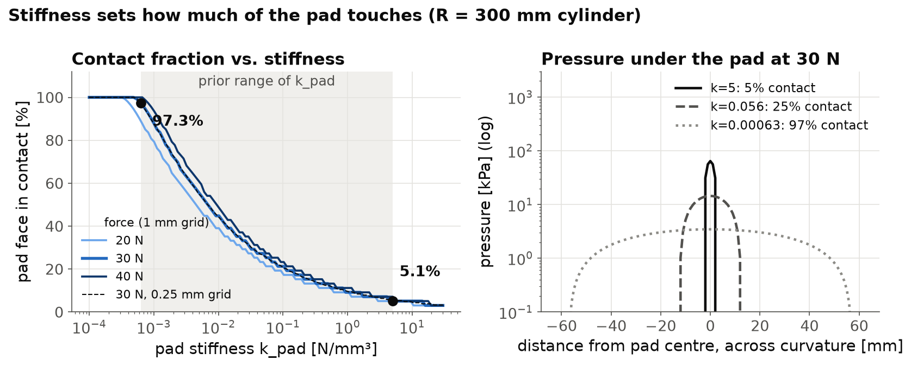
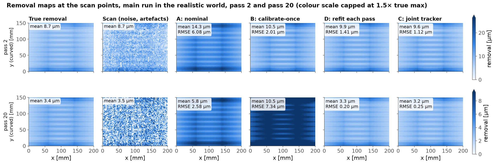
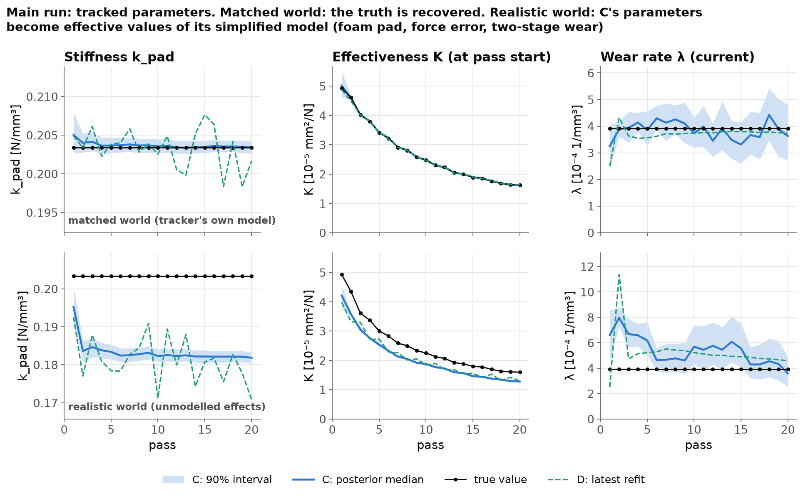
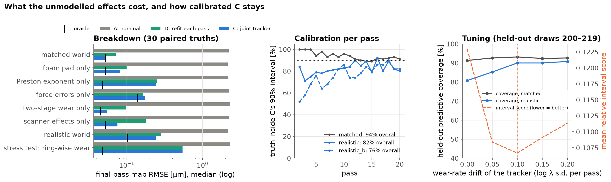
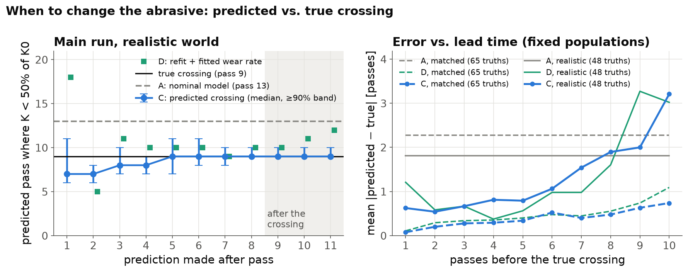
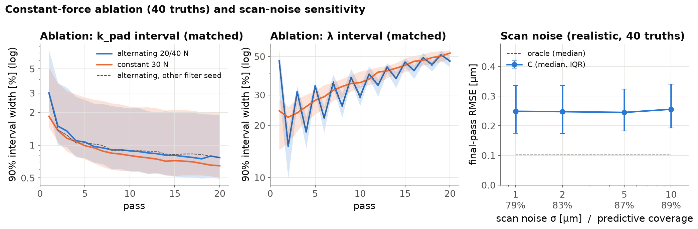

# sanding-wear-tracker

A simulation study of tracking sanding-pad stiffness and abrasive wear together, so that a sanding process model could stay accurate as the paper dulls and say when to change it. The tracker is tested inside its own model, in a "realistic" simulated world with effects it does not model, and in a harsher world fixed before its results were seen. All results are simulated; nothing has been tested on physical parts.


## 1. Summary

A model that predicts how much material a robotic sanding pass removes needs two things it cannot measure directly: how the compliant pad presses on the part (set by a stiffness that is fixed but unknown) and how sharp the abrasive is (which drops every pass). This project simulates a 125 mm pad sanding a curved panel with hidden stiffness and wear parameters and compares four predictors of the next pass's removal map: a nominal model (A), a model calibrated once on the first scan (B), an engineering baseline with the same model structure that refits every scan and extrapolates a fitted wear rate (D), and a particle filter that tracks stiffness, force dependence, current effectiveness, a drifting wear rate and its own wear-noise level with a robust scan model (C). In a *realistic* world that adds a foam pad, a Preston pressure exponent, force-calibration error and force ripple, a two-stage wear law and scanner effects, none of which any predictor models, C's median pass-20 error over 100 hidden truths was 0.250 µm, against 0.303 µm for D (C better averaged over the passes in 86 of 100 draws), 2.13 µm for A, 10.45 µm for B and 0.110 µm for an oracle that knows the true physics and state (median true removal 4.60 µm); deciding pass by pass when to change the abrasive (at 50% of fresh effectiveness), C changed at the right pass in 55 of 96 draws and within one pass in 92, against 54 for D and 75 for a model-free rule that waits for the scans to show the threshold. In its own (matched) world C stays close to the oracle (0.056 vs 0.042 µm) and is calibrated (94% predictive coverage; 90, 99, 93 and 93 of 100 for the four parameters), but the mismatch worlds show clear limits: its 90% predictive intervals cover only 82% in the realistic world (77% in passes 2–5), its parameters become effective rather than true values, and effects that change the shape of the removal map beyond what a linear pad can produce (the pressure profile of the Preston exponent, and abrasive that wears ring by ring) leave errors several times the oracle's; in a harsher second world that includes ring-wise wear, fixed and committed before any of its results were computed, C's error was 0.482 µm (oracle 0.129) with 76% predictive coverage, though it still beat D over the passes in 46 of 50 draws and made the best abrasive-change decisions.

## 2. Credit and scope

This project builds on the problem described in GrayMatter Robotics' post
**[World Models for Manufacturing Processes](https://factory.graymatter-robotics.com/world-models-for-manufacturing-processes/)**
(Hantao Ye, Omey Manyar and Satyandra K. Gupta, 2 September 2026). Three points from the post shape this work:

- **The model.** A sanding world model takes the scanned surface and a candidate action (path, force, grit, spindle speed, dwell) and predicts the result.
- **The stiffness range.** On a curved panel, GrayMatter's simulator predicts contact over roughly 5% to 97% of the pad face across physically plausible stiffnesses. The post does not give the panel radius, pad size or force.
- **The calibration problem.** Pad compliance, abrasive behaviour and wear are hard to identify exactly, so the model is conditioned on real observations.

**This is an independent, simplified simulation of that problem. It uses no GrayMatter data, code or models.** Every result below comes from the simulator in this repository (`results/`, produced by `python -m swt run-all`); the 5–97% contact range is quoted from GrayMatter's post. The extension studied here is having two unknowns at once, one fixed (pad stiffness) and one that changes every pass (abrasive wear), and testing the tracker against effects it does not model.

## 3. Model

Units are mm, N, s and MPa (= N/mm²). Pad stiffness `k_pad` is in N/mm³, abrasive effectiveness `K` in mm²/N (= 1/MPa), and wear rate `λ` in 1/mm³. All parameter values are in `configs/default.yaml`; the copy used for the reported run is in `results/run_info.json`.

The simulator has two layers. The **tracker's model** (below) is what estimators A–D assume. The **hidden process** runs either in that same model (the *matched* world) or in a *realistic* world that adds five effects the estimators do not model (section 3.6).

### 3.1 Workpiece and toolpath (`swt/geometry.py`)
* **The part** is a height map on a 1 mm grid (30351 nodes): a convex cylindrical section, 200 mm along the straight x direction and 150 mm across the curved y direction, radius 300 mm (edges 9.5 mm below the crown).
* **One pass** is a serpentine raster: 11 lines along x, 15 mm apart; pad-centre stations every 5 mm (451 per pass); feed 25 mm/s; 0.25 s dwell at both ends of each line; 93.5 s per pass. The pad centre runs to the panel edge, so edge stations overhang the part.
* **Between passes** only the commanded normal force changes (alternating 20 N / 40 N). Spindle speed is part of the action but constant here.

### 3.2 Pad contact (`swt/pad.py`)
At each station the pad face is held tangent to the surface at the pad centre; a point under the pad lies a gap `g` below the pad plane (0 at the centre, 6.58 mm at the rim of the 125 mm pad). Pushing the pad in by `d` gives a Winkler pressure and a force balance:

```
p = k_pad · max(0, d − g)          [MPa]
Σ_i p_i · A_i = F                  (A_i = pad-face area over grid node i)
```

The balance is piecewise linear in `d` and is solved exactly (sorted gaps, one linear piece); a Brent solver gives the same root in the tests. A stiff pad touches a thin strip under its centre; a soft pad wraps around the curvature.

**Stiffness prior.** At 30 N, contact runs from **5.1% of the pad face for the stiffest pad to 97.3% for the softest**, reproducing the 5–97% range quoted in GrayMatter's post (their geometry is not published, so this calibrates the prior to the quoted range rather than reproducing their setup). At 20 N and 40 N the range is 5.1–89.0% and 7.1–100.0%; on a 0.25 mm grid the 30 N range is 5.8–97.0% (the stiff end is quantised by the 1 mm grid). The softest pads indent 4.1–6.8 mm at 20–40 N, beyond where a linear law holds for real foam; the realistic world's foam pad addresses this (section 3.6).



### 3.3 Removal (`swt/process.py`): Preston's law with wear during the pass
```
dh = K · p · v · dt
```
`v` is the RMS sliding speed of a random-orbital sander (5 mm orbit at 8000 rpm plus free pad rotation at 2% of spindle speed), `v(r) = sqrt((π·D_orb·f)² + (2π·f·0.02·r)²)`, from 2094 mm/s at the pad centre to 2342 mm/s at the rim. With nominal parameters a fresh abrasive removes on average 8.1 µm at 20 N and 16.1 µm at 40 N.

**Wear.** `K = K0 · exp(−λ·W)`, with `W` the cumulative removed volume (by analogy with the grinding G-ratio; an assumption, untested here). Wear acts *during* the pass: within a pass `K(U) = K_start / (1 + λ·K_start·U)`, where `U` is the volume the pass would have removed at unit effectiveness so far. It is applied at the resolution of one raster line, using each line's exact average effectiveness, so the volume of the removal map is exactly the volume that drives the wear (a test checks this to 1e-9). Between passes a small multiplicative fluctuation stands in for abrasive variability:

```
K_{n+1} = K_n · exp(−λ·ΔV_n + σ_w·ξ_n),   ξ_n ~ N(0, 1),   σ_w = 0.01
```

### 3.4 Scan (`swt/scan.py`)
The scanner reports each pass's removal on a 2 mm sub-grid (7676 points, read as profiles along y, one every 2 mm in x) with independent Gaussian noise, σ = 2 µm. In the realistic world it also has artefacts (section 3.6).

### 3.5 Hidden truth and priors
| Parameter | Prior | Notes |
|---|---|---|
| `k_pad` | log-uniform on [0.00063, 5] N/mm³ | 97% to 5% contact at 30 N |
| `K0` (fresh effectiveness) | log-normal, median 6.0e-5 mm²/N, σ_log 0.25 | |
| `λ` (wear rate) | log-normal, median 2.5e-4 1/mm³, σ_log 0.35 | |
| wear fluctuation | σ_w = 0.01 per pass | the tracker's starting assumption |

Each draw id fixes `k_pad`, `K0`, `λ` (and the realistic world's force error) through its own random streams, so every world and schedule sees the same hidden parameters for the same draw. Draws 0–99 are used for the reported experiments and draws 200–219 only for tuning (section 3.8).

### 3.6 The realistic world: effects no estimator models
| Group | What the hidden process does | Size |
|---|---|---|
| **Foam pad** | `p = k·δ / (1 − δ/h)`, h = 15 mm: the pad stiffens as it densifies (same small-strain stiffness `k`) | softest pad at 40 N: peak strain 35%, peak pressure ×1.19, contact 96% instead of 100%; negligible for mid and stiff pads (×1.01 at the nominal pad) |
| **Preston exponent** | removal ∝ `p^α` instead of `p` (`dh = K·p_ref·(p/p_ref)^α·v·dt`, p_ref = 10 kPa): the force dependence and the pressure profile both change | α = 0.8; at 30 N a soft pad removes 1.73× the volume per unit `K` of a stiff pad (1.0 for α = 1) |
| **Force errors** | actual force = gain × commanded (one gain per run), and each raster line runs at its own force, AR(1) along the pass (first-order exposure model, checked against the exact model to < 0.1%) | gain: log-normal, σ_log = 0.04; ripple σ = 3% per line, correlation 0.5 between lines |
| **Two-stage wear** | `K/K0 = (1−f)·e^{−λW} + f·e^{−rλW}`: a fast break-in of the sharpest grit tips plus slow dulling (f = 0.25, r = 6), integrated within the pass | `K` halves after 1766 mm³ instead of 2773 mm³ (nominal λ) |
| **Scanner effects** | per-scan misregistration of the whole map; a constant offset per scan profile; outliers; missing points (isolated and 8-point gaps along profiles); and the removal is measured as the difference of the height scans before and after the pass, each pass leaving a new random surface texture (so each texture enters two consecutive scans with opposite signs) | registration σ = 0.3 mm per axis; profile offset σ = 0.5 µm; 0.5% outliers of σ = 15 µm; 2% missing; texture 1 µm RMS, correlation length 1 mm |

Each group is also run on its own ("only" worlds). Two further worlds:
* **Stress test: ring-wise abrasive wear** (`radial_wear`, not part of the realistic world). The pad face is split into 6 rings, each of which dulls with its own local work. A stiff pad touches only a strip through its centre, so its centre wears out first and the shape of the removal map changes over time, which neither C's nor D's model family can represent. With nominal parameters, a stiff pad's effective `K` after 20 passes is 33% of fresh against 37% with uniform wear (soft pad: 36% vs 37%).
* **A second, harsher world, pre-registered** (`realistic_b`). Its effects and sizes were committed to the repository (commit `e05601c`) before any result in it was computed, and it was never used for tuning or development: foam pad h = 10 mm, Preston exponent 0.7, force gain σ_log 0.06 and ripple 5% (correlation 0.7), two-stage wear with f = 0.4, r = 4 *and* ring-wise wear (6 rings), registration σ 0.5 mm, profile offsets 1 µm, 1% outliers, 5% missing, texture 1.5 µm.

The **oracle** reference always uses the hidden process's own physics.

### 3.7 Estimators (`swt/estimators.py`)
All four see the commanded action of every pass and the scans, and nothing else; before each pass each predicts that pass's removal at the scan points.

**A: nominal.** Prior-mean parameters (geometric-mean stiffness 0.0561 N/mm³, prior medians of `K0` and `λ`), wear propagated with its own predicted volume, never updated.

**B: calibrate-once.** Least-squares `k_pad` and `K` from the first scan (`K` profiled out, 1-D search over log `k_pad`), then frozen, no wear model. The "learn the pad once" baseline.

**D: refit each pass** (the engineering baseline, with the same model structure as C). On *every* scan: a least-squares fit of `k_pad` and `K` (effectiveness at the start of the pass) including the within-pass wear at the current wear-rate estimate, after rejecting points more than 5 robust s.d. from a first fit. A least-squares fit of log `K_i` against the cumulative removed volume gives the wear rate and, once two forces have been scanned, a log-force term gives the force exponent. The next pass uses the latest `k_pad` and `K`, extrapolated through the pass just scanned and rescaled to the next force; the abrasive-change forecast extrapolates the same fit. Point predictions only. What D lacks compared with C is the probabilistic pooling of all scans and any uncertainty.

**C: joint tracker.** A sequential Monte Carlo filter with 2000 particles over log `k_pad`, a force exponent `β`, the wear-fluctuation level `σ_w` (all static) and the paths of log `K` and log `λ` (one value per pass):
* *Process model:* removal of a pass with scale `K·F·s·(F/F_ref)^(β−1)` (`β` = 1 is Preston's law; prior N(1, 0.15²) on [0.5, 1.5], F_ref = 30 N) and within-pass wear as in 3.3; between passes `log K` follows the wear law plus noise of s.d. `σ_w`, and `log λ` takes a random-walk step of s.d. `δ` (the *wear-rate drift*), so the wear rate can follow the recent decay when the true law is not exponential. `σ_w` has a log-uniform prior on [0.005, 0.05] and is learned from how much `K` varies beyond the wear law; `δ` is tuned on held-out draws (3.8).
* *Update:* the scan likelihood is applied in tempered stages that keep the effective sample size at 75% of N. After each stage the particles are resampled systematically and moved by Metropolis–Hastings steps that leave the exact path posterior invariant: a joint random walk on log `k_pad`, `β` and a common shift of the whole log `λ` path; a random walk on log `σ_w`; and local moves on log `λ` and log `K` near the current pass. After the last stage a full-path sweep also moves log `K` and log `λ` at every earlier pass. Every past scan is kept as O(1) sufficient statistics, so every move evaluates the full path posterior. The number of distinct particle values left at the most degenerate stored pass is recorded per pass (`C_min_path_diversity`).
* *Robust measurement model:* (i) points more than 5 robust s.d. from C's own prediction for the pass are rejected (on pass 1, from the fitted map, with one redo); (ii) a random offset per scan profile is added to the noise model when the profile means vary significantly more than the noise explains (variance estimated from the residuals, folded exactly into the sufficient statistics via the Woodbury identity); (iii) the noise level is re-estimated from the residuals and inflated when they are spatially correlated. In the matched world they almost never act (median 0 rejected points per scan, 4 of the 100 × 20 updates redone); in the realistic world the median is 15 rejected points per scan and 286 updates were redone.
* *Speed:* removal depends on stiffness only through `η = F/k_pad`; maps at the scan points are tabulated once on 512 log-spaced η values, with the within-pass wear expanded to third order. Against the exact model the relative RMS error is at most 1.7e-03 (median 3.4e-05, 90 checks). The hidden process and A, B use the exact model; D uses the same table as C.
* *Outputs:* posterior median and 90% interval of `k_pad`, `K0`, current `K`, current `λ` and `β`; a 90% predictive interval of the next pass's mean removal; and the predicted abrasive-change pass with a ≥90% band (particles rolled forward with their own `σ_w`, random future wear and wear-rate drift).

**Oracle (reference).** Knows the hidden process's physics and its true state after the previous pass, but not the wear fluctuation drawn since then, nor the coming pass's force ripple or surface texture. Its error is a floor in expectation; on single passes C can beat it by luck.

### 3.8 Tuning, development and what changed after the first full run
The wear-rate drift `δ` is the only setting tuned by the pipeline. `run-all` runs C with each `δ` of 0, 0.05, 0.1, 0.15 and 0.2 on held-out draws 200–219 in the matched and realistic worlds, and keeps the value with the lowest mean *interval score* of the 90% predictive interval of next-pass mean removal (a proper scoring rule: interval width plus 20× any miss; Gneiting & Raftery 2007). It chose **δ = 0.1**.

This is the second full run. After the first one (on draws 0–99) an independent review pointed out weaknesses, and these changes were made before this run: D gained within-pass wear, outlier rejection and a force term; C's heuristic adaptive process noise was replaced by the learned `σ_w`, a full-path sweep and the force exponent `β` were added; the realistic world gained the Preston exponent and the scan texture, and ring-wise wear was moved to a separate stress test after held-out checks showed that no estimator here can represent it. The checks for these changes used held-out draws 200–239 only. Other settings (75% ESS target, one final full-path sweep, outlier threshold 5, the `σ_w` and `β` priors) were fixed by hand during development.

## 4. Results

All numbers come from `results/` and were produced by `python -m swt run-all` with seed 2026. Unless a section says otherwise, every run has 20 passes, forces alternating 20/40 N, 2 µm scan noise and the 50%-of-K0 abrasive-change threshold. Errors are RMSE over the 7676 scan points against the simulator's noise-free removal (not against the scan). Brackets after medians are IQRs unless marked as 90% bootstrap intervals (2000 resamples of the draws).

**At a glance: removal-map RMSE at pass 20, µm, median [IQR]**

| world | A: nominal | B: calibrate-once | D: refit each pass | C: joint tracker | oracle |
|---|---|---|---|---|---|
| matched (100 draws) | 2.20 [1.52–4.24] | 10.62 [8.92–13.16] | 0.071 [0.049–0.102] | **0.056 [0.031–0.088]** | 0.042 |
| realistic (100 draws) | 2.13 [1.49–3.49] | 10.45 [8.54–12.53] | 0.303 [0.218–0.364] | **0.250 [0.189–0.336]** | 0.110 |
| second world (pre-registered) (50 draws) | 2.69 [1.98–3.47] | 11.30 [8.60–13.60] | 0.540 [0.412–0.655] | **0.482 [0.362–0.591]** | 0.129 |

**C against D** (paired over draws; 90% bootstrap intervals in brackets)

| world | D/C error ratio at pass 20, median | C better at pass 20 | D/C ratio of the mean error over passes, median | C better over passes |
|---|---|---|---|---|
| matched | 1.24 [1.10–1.41] | 67 / 100 [59–75%] | 1.08 [0.91–1.24] | 53 / 100 [45–61%] |
| realistic | 1.11 [1.10–1.18] | 78 / 100 [71–85%] | 1.27 [1.24–1.31] | 86 / 100 [80–91%] |
| second world (pre-registered) | 1.09 [1.05–1.13] | 45 / 50 [82–96%] | 1.22 [1.20–1.25] | 46 / 50 [86–98%] |

**C's calibration** (target 90%)

| world | next-pass mean removal inside the 90% predictive interval, passes 2–20 | truth below / above | passes 2–5 / 11–20 | true parameter inside the 90% interval at pass 20: k_pad / λ / K / K0 |
|---|---|---|---|---|
| matched | 1782 / 1900 (93.8%) | 58 / 60 | 98% / 91% | 90 / 99 / 93 / 93 of 100 |
| realistic | 1563 / 1900 (82.3%) | 41 / 296 | 77% / 85% | 1 / 91 / 6 / 3 of 100 |
| second world (pre-registered) | 722 / 950 (76.0%) | 45 / 183 | 64% / 82% | 4 / 34 / 5 / 4 of 50 |

With 100 draws, the binomial standard error of a calibrated 90% parameter coverage is 3 points. In the mismatch worlds the parameter intervals describe *effective* parameters (section 4.1) and are not expected to cover the true values.

### 4.1 Main run: one hidden truth in both worlds

The draw is chosen by a rule that looks only at the sampled truths: among the 100 robustness draws, the one at the median standardised distance from the prior centre in (log k_pad, log K0, log λ). It is draw 15: `k_pad` = 0.2034 N/mm³, `K0` = 4.93e-05 mm²/N, `λ` = 0.000392 1/mm³, and in the realistic world a force gain of 0.979. Its abrasive crosses 50% at pass 11 in the matched world and at pass 9 in the realistic world (the break-in brings it forward); A's nominal model says pass 13.

| Removal-map RMSE [µm] | A | B | D | C | oracle |
|---|---|---|---|---|---|
| realistic, pass 2 | 6.08 | 2.01 | 1.41 | 1.12 | 0.27 |
| realistic, pass 20 | 2.58 | 7.34 | 0.196 | 0.249 | 0.083 |
| matched, pass 20 | 1.91 | 8.89 | 0.060 | 0.096 | 0.065 |



* **B** is good right after its calibration but never learns that the paper is dulling, so its error grows with every pass.
* **A** has the wear law but the wrong parameters.
* **D and C** both follow the wear. On this draw D's pass-20 error is lower than C's in both worlds; single passes are noisy, and section 4.2 has the statistics over 100 draws.
* **Parameters at pass 20 (figure 4):**

  | | C: median [90% interval], matched world | C: median [90% interval], realistic world | truth |
  |---|---|---|---|
  | `k_pad` [N/mm³] | 0.2034 [0.2027, 0.2042] | 0.1819 [0.1803, 0.1833] | 0.2034 |
  | `λ` [1/mm³] | 0.000363 [0.000274, 0.000481] | 0.000359 [0.000257, 0.000492] | 0.000392 |
  | `K0` [mm²/N] | 4.94e-05 [4.91e-05, 4.98e-05] | 3.96e-05 [3.88e-05, 4.03e-05] | 4.93e-05 |

  In the realistic world the same tracker converges on an *effective* stiffness and an effective wear rate that is high during the break-in and falls later: the best linear-pad, exponential-wear description of a process that is neither, with the force gain absorbed into the effectiveness. Its map predictions remain good because they only need the effective values to reproduce the removal, not to equal the true parameters.



### 4.2 Robustness: what the numbers say

* **Map accuracy.** A and B are one to two orders of magnitude worse than C and D throughout (figure 3). **In the matched world C and D are about equally accurate**: averaged over passes C is better in 53 of 100 draws, and the median per-pass error is lower for D at a few passes. **In the mismatch worlds C is more accurate than D**: averaged over passes in 86 of 100 realistic draws and 46 of 50 in the second world.
* **What C adds over D.** Both share the model structure; C pools every scan in one posterior (D uses the latest scan for `k_pad` and `K` and a straight-line fit for the wear) and carries calibrated uncertainty. In the tracker's own world that buys little map accuracy; under mismatch the pooling, the robust scan model and the drifting wear rate do, and the uncertainty is what makes the abrasive-change decisions of section 4.4 work.
* **Calibration.** In the matched world C's predictive intervals are close to nominal (slightly conservative in the first passes, while `σ_w` is still uncertain) and its parameter intervals cover the truth at about the nominal rate. In the realistic world the predictive intervals under-cover, most in the first passes, and the misses lean towards the truth being above the interval: the abrasive keeps cutting better than an exponential law fitted through the break-in predicts.

### 4.3 What each unmodelled effect costs

Each group of the realistic world was also run alone, on the first 30 draws (same draws in every world; figure 7, left), plus the ring-wise wear stress test.

| world (30 draws, pass 20) | C RMSE [µm] | D RMSE [µm] | oracle [µm] | C / oracle | predictive coverage (misses below↓ above↑) | crossing error, last pass before (mean, passes) |
|---|---|---|---|---|---|---|
| matched | 0.052 | 0.072 | 0.052 | 1.32 | 92% (29↓ 19↑) | 0.14 |
| foam pad only | 0.082 | 0.100 | 0.052 | 1.35 | 92% (23↓ 22↑) | 0.14 |
| Preston exponent only | 0.242 | 0.254 | 0.048 | 4.93 | 92% (18↓ 28↑) | 0.30 |
| force errors only | 0.176 | 0.164 | 0.139 | 1.15 | 85% (44↓ 42↑) | 0.62 |
| two-stage wear only | 0.054 | 0.099 | 0.045 | 1.28 | 92% (17↓ 30↑) | 0.33 |
| scanner effects only | 0.076 | 0.179 | 0.052 | 1.46 | 91% (13↓ 38↑) | 0.21 |
| realistic (all of the above) | 0.240 | 0.284 | 0.102 | 2.39 | 84% (15↓ 77↑) | 0.52 |
| stress test: ring-wise wear | 0.544 | 0.544 | 0.048 | 12.11 | 85% (81↓ 3↑) | 0.27 |

* **Preston exponent:** C and D both learn the force dependence (`β`), so the alternating 20/40 N schedule no longer produces alternating biases, but the flatter `p^0.8` pressure profile cannot be reproduced by any linear-pad stiffness: this is the largest single cost in map accuracy.
* **Force errors** raise everyone's error, the oracle's included (the line-to-line ripple is unpredictable). Here D is slightly more accurate than C, and C's intervals under-cover on both sides until its `σ_w` estimate has grown.
* **Two-stage wear** costs little map accuracy, but the misses lean to one side and the long-range crossing forecasts are biased (section 4.4).
* **Scanner effects** hurt D (no offset model, simple outlier rejection) much more than C, whose per-profile offset model and innovation gating absorb most of them (the tests check both). C does not correct misregistration, and treats the scan texture, which is correlated between consecutive scans, as noise.
* **The foam pad** changes the map noticeably only for soft pads; stiffness becomes an effective value.
* **Ring-wise wear (stress test)** changes the *shape* of the removal map as the pad centre dulls. Neither model family can represent that, and C and D fail alike: their error is more than ten times the oracle's, and C's predictions are mostly too high. A tracker for such pads would need a ring-resolved effectiveness.



### 4.4 When to change the abrasive (threshold: K < 50% of K0)

**Sequential decision rules.** After each scanned pass, each rule decides whether the next pass runs on fresh abrasive. The ideal is to change at the true crossing pass c (the first pass that would start below 50% of fresh). Error = change pass − c: positive means passes run on worn abrasive, negative means abrasive life thrown away. Only draws whose crossing falls inside the run (c ≤ 21) are scored; a rule that has not fired by pass 20 counts as changing at pass 21. The last column counts premature changes on the draws that cross later.

| world | rule | mean abs. error [passes] | exact | within ±1 | late (mean passes late) | early (mean passes early) | premature, later-crossing draws |
|---|---|---|---|---|---|---|---|
| matched | C: change when P(crossed by next pass) ≥ 50% | 0.18 | 76 | 90 | 8 (0.09) | 7 (0.09) | 0 |
| matched | D: change when its forecast says next pass | 0.38 | 60 | 87 | 19 (0.23) | 12 (0.15) | 0 |
| matched | A: nominal schedule (fixed in advance) | 2.93 | 14 | 24 | 42 (1.62) | 35 (1.32) | 9 |
| matched | R: reactive, removal per newton below 50% of first scan | 1.13 | 6 | 73 | 85 (1.13) | 0 (0.00) | 0 |
| realistic | C: change when P(crossed by next pass) ≥ 50% | 0.48 | 55 | 92 | 27 (0.31) | 14 (0.17) | 0 |
| realistic | D: change when its forecast says next pass | 1.48 | 8 | 54 | 79 (1.25) | 9 (0.23) | 0 |
| realistic | A: nominal schedule (fixed in advance) | 3.64 | 7 | 16 | 70 (3.14) | 19 (0.50) | 4 |
| realistic | R: reactive, removal per newton below 50% of first scan | 0.77 | 43 | 75 | 33 (0.48) | 20 (0.29) | 3 |
| second world (pre-registered) | C: change when P(crossed by next pass) ≥ 50% | 0.76 | 19 | 45 | 22 (0.54) | 9 (0.22) | 0 |
| second world (pre-registered) | D: change when its forecast says next pass | 2.44 | 5 | 17 | 19 (0.74) | 26 (1.70) | 0 |
| second world (pre-registered) | A: nominal schedule (fixed in advance) | 5.06 | 3 | 4 | 46 (5.02) | 1 (0.04) | 0 |
| second world (pre-registered) | R: reactive, removal per newton below 50% of first scan | 0.90 | 22 | 35 | 17 (0.48) | 11 (0.42) | 0 |

Draws scored: 91 (matched), 96 (realistic), 50 (second world). C's rule is the most accurate in every world. The reactive rule R needs no model and is the bar a forecast has to beat; in the matched world it is almost always one pass late, as a rule that waits for evidence must be, while in the mismatch worlds the force dependence and the noise make it fire early or on time in some draws. D's point forecast, without uncertainty, changes late more often than C.

**Forecast error by lead time** (figure 5, right; fixed populations of draws whose crossing every lead can see): in the matched world C is more accurate than A at every lead and than D at almost every lead. In the realistic world C is the more accurate only at the shortest leads, and D's straight-line forecast is better at intermediate leads; early forecasts are biased early (C's mean signed error after pass 2: -1.12 passes), because the break-in makes the abrasive look as if it wears faster than it will. Five passes ahead C's mean error is 0.79 passes (D 0.56, A 1.81); one pass ahead 0.62 (D 1.21).



### 4.5 Tuning: what the drifting wear rate buys

| wear-rate drift δ (held-out draws 200–219) | 0 (constant rate) | chosen: 0.1 |
|---|---|---|
| predictive coverage, matched | 91.3% | 93.2% |
| predictive coverage, realistic | 80.8% | 90.0% |
| median relative width of the 90% interval, realistic | 10.21% | 9.40% |
| mean interval score (lower is better; both worlds) | 0.1229 | 0.1067 |

Larger drifts raise the realistic world's coverage further but widen the intervals more than they gain (figure 7, right), so the proper scoring rule stops at 0.1. The choice is made inside `run-all`, on draws not used anywhere else.

### 4.6 Identifiability ablation: constant 30 N instead of alternating 20/40 N

On the first 40 draws of the matched world, a constant 30 N schedule (same mean force) was compared with the alternating one, and a re-run of the alternating schedule with a different filter seed gives the spread expected from Monte Carlo noise alone.

| Paired over draws, pass 20 | constant ÷ alternating | other seed ÷ alternating |
|---|---|---|
| k_pad 90% width, median ratio (draws wider) | 0.964 (16 of 40) | 1.004 (21) |
| λ 90% width, median ratio (draws wider) | 1.114 (38) | 1.006 (23) |

**This did not show what was expected.** Alternating the force did not narrow the stiffness interval at all. Because the force is commanded and known, a single force level already pins `F / k_pad` from the shape of one removal map; a second force adds a second view of the same thing. Alternating did narrow the wear-rate interval slightly and consistently, because two forces remove different volumes and so trace the wear law at two rates. Varying the force would matter if something else also changed the contact shape (an unknown force offset, uncertain curvature, a drifting pad); with the realistic world's force-calibration error it could help separate gain from effectiveness, which was not tested.



### 4.7 Scan-noise sensitivity (realistic world, first 40 draws)

| scan noise σ [µm] | 1 | 2 | 5 | 10 |
|---|---|---|---|---|
| C pass-20 RMSE, median [µm] | 0.249 | 0.248 | 0.245 | 0.256 |
| oracle, median [µm] | 0.102 | 0.102 | 0.102 | 0.102 |
| predictive coverage | 79% | 83% | 87% | 89% |

In the realistic world C's error barely depends on scan noise up to 10 µm: with thousands of points per scan the noise averages out, and the error is dominated by what neither scans nor the oracle can predict (force ripple, fluctuations) and by model mismatch. Coverage rises with the noise because noisier scans leave C less certain, which partly offsets the mismatch.

### 4.8 The pre-registered second world

`realistic_b` (section 3.6) was committed before any of its results existed and was not used for tuning; it is harsher than the realistic world and includes the ring-wise wear that neither model can represent. Over 50 draws, C's pass-20 error was 0.482 µm (D 0.540, oracle 0.129, true removal 3.62 µm), C was better than D over passes in 46 of 50 draws, and its 90% predictive intervals covered 76% of next-pass mean removals. The decision rules on this world are in the table of section 4.4.

## 5. Limitations

* **Simulated only.** Nothing here has touched a physical part. The realistic worlds are richer simulators, not reality: their effects and sizes were chosen by me, not measured, and real processes contain effects in none of them (loading and clogging of the abrasive, heat, grit changes, pad ageing, robot path errors).
* **Same author for the worlds and the tracker.** The scanner-offset model, the outlier gating and the force exponent address effects I also put into the realistic world. The pre-registered second world limits how much the tracker could be tuned to it, but it was designed by the same person.
* **Effects outside the model family.** Ring-wise abrasive wear and the pressure-profile part of a Preston exponent change the *shape* of the removal map in ways no linear-pad stiffness reproduces; C and D both degrade badly under ring-wise wear (section 4.3).
* **Under-coverage under mismatch.** C's 90% predictive intervals cover 82% in the realistic world (77% in passes 2–5) and 76% in the second world. Calibration is checked for the mean removal of the next pass, not for the map point by point.
* **Parameters are only meaningful in the matched world.** Under mismatch C's stiffness, wear rate and force exponent are effective values, not physical properties.
* **Long-range abrasive-change forecasts** are biased early when the wear law has a break-in phase (section 4.4).
* **Registration error is not corrected**; C treats misregistration as structured noise.
* **Winkler-type pad.** Both pad laws are independent springs: no shear coupling, no bending of the backing plate, no tilt over an overhanging edge. The contact uses the nominal (CAD) surface; removal is not fed back into the contact.
* **One abrasive, removal depth only.** One grit per run; no roughness or other finish metric (the scan texture is a measurement effect only).
* **Grid effects.** The 1 mm grid quantises the stiffest contact strips (section 3.2).
* **Surrogate.** C's table has a worst-case relative error of 1.7e-03 against the exact model, at the fastest-wearing draws (third-order expansion of the within-pass wear).
* **Not validated on physical coupons.**

## 6. Next steps that would make it real

1. **Fit the wear law to coupon data.** Scan coupons after every pass at several forces and grits; measure break-in, the force exponent, pass-to-pass fluctuation and whether the pad centre wears faster. This decides whether the tracker needs a break-in state and a ring-resolved effectiveness.
2. **Ring-resolved effectiveness in the tracker** (a few rings, with a smoothness prior), so that non-uniform wear changes the predicted map shape instead of biasing the stiffness.
3. **A transient per-pass removal term** (force ripple, local loading) separate from the persistent wear, so that early-pass intervals are calibrated without waiting for `σ_w` to be learned.
4. **Register each scan to the prediction** (two shifts per scan as nuisance parameters) before updating.
5. **Replace the spring pad** with a finite-element or learned pad model, including tilt over edges.
6. **Run on GrayMatter-style scan data** with real registration error, missing data and noise.
7. **Use the tracker for decisions**: choose the next pass's force or dwell to hit a target removal, and the abrasive change from the predicted crossing distribution and the cost of a bad pass.

## 7. How to reproduce

Requires Python ≥ 3.11. The recorded run used Python 3.11.15 and NumPy 2.4.6; see `results/run_info.json`.

```bash
pip install -r requirements.txt          # numpy, scipy, matplotlib, pyyaml, pytest
python -m swt run-all                    # every experiment, every figure, every number in results/
python -m swt report                     # re-render README.md and SUMMARY.md from results/
python -m swt run --config configs/default.yaml    # main 20-pass experiment only (uses results/tuning.json if present)
python -m pytest -q                      # tests
```

* **Runtime.** `run-all` runs 630 multi-draw episodes, plus the tuning runs and the main run, using `min(4, CPUs)` worker processes. In the recorded run, building the model and surrogate took 7 s and the experiments 512 s with 4 workers on a 4-CPU machine. `--workers 1` runs serially; results are identical for any worker count because every task has its own seeds.
* **Outputs.** `results/` holds per-pass CSVs, per-draw CSVs, JSON summaries and `run_info.json` (config, versions, source hash). `summary.json` gathers everything. `figures/` holds seven PNGs drawn only from `results/` (`python -m swt figures` redraws them).
* **How the documents are made.** `README.md` and `SUMMARY.md` are rendered from `docs/*.template.md`, in which every number is a lookup into `results/summary.json` or `results/run_info.json`. A test fails if the shipped documents differ from what the templates render from the shipped results.
* **Changing the model.** Edit `configs/default.yaml` (geometry, pad, sander, path, schedule, scan, priors, filter, worlds, experiments, tuning) and rerun. The prose describes the default configuration.

Repository layout:

```
swt/geometry.py     panel height map and raster toolpath
swt/pad.py          contact and force balance (linear and foam pad laws)
swt/process.py      Preston removal, sliding speed, within-pass wear, worlds, hidden-truth simulator
swt/scan.py         noisy, downsampled scans with optional artefacts
swt/surrogate.py    scan-point table and O(1) likelihood terms (missing points, profile offsets)
swt/estimators.py   A nominal, B calibrate-once, D refit each pass, C particle filter
swt/experiments.py  all experiments, including tuning; writes results/
swt/plots.py        all figures, drawn from results/ only
swt/report.py       renders README.md / SUMMARY.md from docs/*.template.md and results/
swt/cli.py          command-line entry point (python -m swt ...)
configs/default.yaml
docs/               README and SUMMARY templates
tests/              pytest suite (incl. an end-to-end run on a tiny configuration)
```
