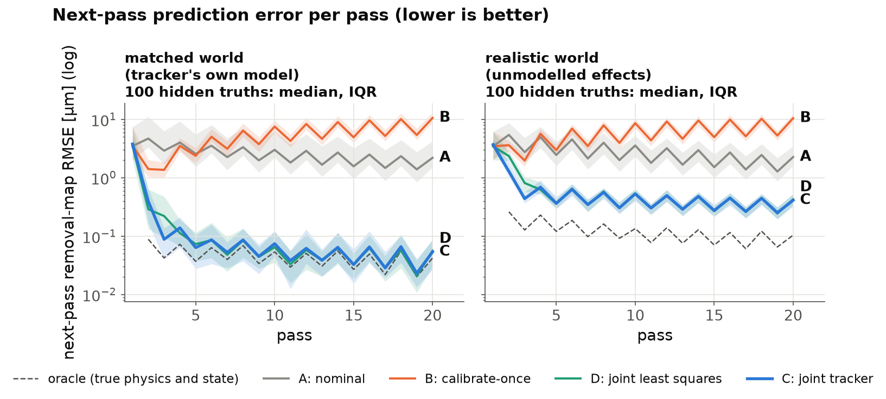

# sanding-wear-tracker: summary

This simulation study asks whether a sanding process model can keep track of two unknowns at once, a pad stiffness that is fixed but uncertain and an abrasive sharpness that drops every pass, including when the simulated process contains effects the tracker does not model (a foam pad, a Preston pressure exponent, force errors, abrasive break-in and uneven wear, scanner artefacts). It was motivated by GrayMatter Robotics' post *[World Models for Manufacturing Processes](https://factory.graymatter-robotics.com/world-models-for-manufacturing-processes/)*, but it is independent work and uses no GrayMatter data or code. A particle filter that re-estimates stiffness, force dependence, effectiveness and a drifting wear rate from each post-pass scan predicted the next pass far better than a nominal model or a model calibrated once, but after the first three scans no better than a least-squares fit of the same model with the same priors; its value was calibrated uncertainty, which gave abrasive-change decisions (the Bayes rule under its own model, with no tuning) about as good as point forecasts with safety margins tuned on held-out data. Under unmodelled effects its intervals missed the shape of the removal map, stress tests such as a tilting pad holder and abrasive loading defeated it, and nothing was tested on physical parts.

**Key number:** in the world with unmodelled effects, over 100 simulated hidden truths, the particle filter's removal-map error from the fourth pass on was the same as the least-squares fit's (median ratio 1.00, 90% interval 0.99–1.01), while on the first two predictions the least-squares fit's error was 1.8 times larger; in the world fixed together with the final tracker, before either was run, the steady-state ratio was 0.99 (0.98–1.00), the least-squares fit slightly better.

Full model, results, weak spots and limitations: [README.md](README.md).
